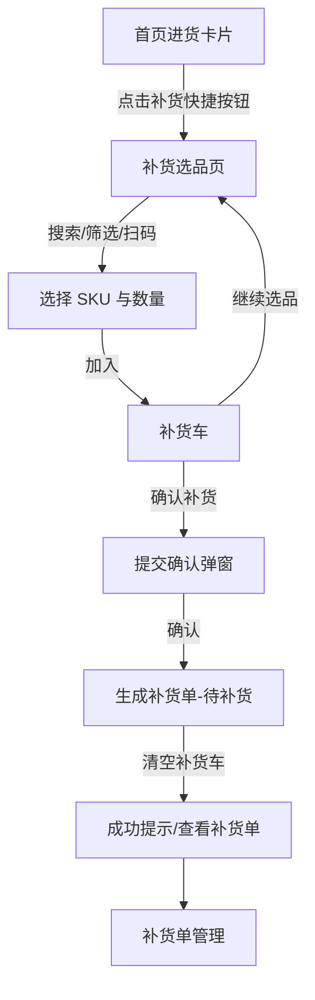
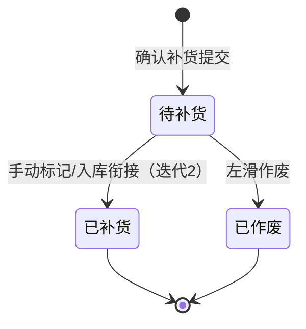

# PRD：补货采购请求

> 维护说明（2026-08-07）：本文是 SKU 补货采购请求的历史 PRD，不包含采购进货页「补货单」Tab。后者是独立的平台注册货品/其他货品处理功能，页面ID为 `replenishment-tab`，不得与本文模型、字段或状态机混用。当前老板账号 v1.43.6 未在首页看到本文设计的「补货」快捷入口，入口仍需确认。

## 一、文档信息

| 字段 | 内容 |
|------|------|
| 文档版本 | v1.1 |
| 作者 | PM Agent |
| 日期 | 2026-08-07 |
| 关联需求 | 生成补货：首页进货卡片「补货」按钮 → 选择货品 SKU 加入补货车 → 确认补货提交 |
| 评审状态 | 待评审 |
| v1.1 修订 | 入口由「首页功能入口区」改为「首页进货卡片右上角『补货』快捷按钮」（对齐多店版快捷操作范式） |

> **待确认假设声明**：本 PRD 中标注 ⚠️ 的规则为基于产品知识库与行业惯例的默认假设，需评审确认；如与预期不符，须修订后再进入开发。

## 二、背景与目标

### 2.1 背景

服装零售门店经营中，热销款常出现断码、库存不足（缺货）情况。当前流程下，店主需在「货品管理」中逐个判断 SKU 库存，再进入「进货入库」新建入库单，操作路径长、易遗漏，无法在缺货场景下快速发起补货。

本需求提供轻量「补货」闭环：首页进货卡片「补货」按钮 → 选择货品 SKU 加入补货车 → 确认补货提交，生成补货单。

### 2.2 目标

- 让店主/采购人员在 3 步内完成一次补货发起（进入补货页 → 加车 SKU → 确认提交）。
- 支持一次选择多个 SKU 批量提交，减少重复操作。
- 生成可追踪的补货单，为后续与「进货入库」衔接提供数据源。

### 2.3 非目标

- ⚠️ 确认补货后**不直接增加库存、不直接生成入库单/进货单**（补货单为采购请求性质；真正到货需走「进货入库」）。【假设1】
- 不做缺货自动提醒、建议补货量（迭代规划外）。
- 不做跨会话持久化的补货车（⚠️ 默认仅当前会话保留）【假设2】。
- 不做补货单审批流。

## 三、用户与场景

| 用户角色 | 使用场景 | 核心诉求 |
|---------|---------|---------|
| 店主 | 盘点热销款后集中补货 | 快速选 SKU、批量提交 |
| 采购人员（有「进货」权限） | 接到缺货信息后发起补货 | 基于 SKU 库存判断补货数量 |
| 店员（无「进货」权限） | — | 不可访问补货入口（权限前置） |

## 四、功能需求

### 4.1 功能总览

| 功能点 | 优先级 | 迭代 |
|--------|--------|------|
| FP1 首页进货卡片「补货」入口 | Must | MVP |
| FP2 补货选品页（搜索/筛选/扫码选 SKU） | Must | MVP |
| FP3 补货车管理（加车/数量/删除/清空） | Must | MVP |
| FP4 确认补货提交（生成补货单） | Must | MVP |
| FP5 补货单管理（列表/详情/状态） | Should | MVP |
| FP6 补货单转进货入库 | Could | 迭代 2 |

### 4.2 详细功能说明

#### FP1 首页进货卡片「补货」入口

**功能描述**：在首页进货卡片右上角新增「补货」快捷按钮，与「进货」快捷按钮并排，对齐开单/进货/添客/建款的快捷操作范式。

**业务规则**：
- 入口展示条件：当前用户岗位拥有「进货」权限时显示，否则不显示（⚠️ 与进货入库权限一致）【假设3】。
- 点击按钮进入「补货」主页（补货选品页/补货车页）。

**边界与异常**：
- 无「进货」权限时按钮隐藏，不展示无权限提示（避免暴露功能）。

**验收标准**：
- Given 当前用户拥有「进货」权限，When 打开首页，Then 进货卡片右上角展示「补货」快捷按钮。
- Given 当前用户无「进货」权限，When 打开首页，Then 进货卡片不展示「补货」按钮。

#### FP2 补货选品页

**功能描述**：进入补货页后，支持按条件选择货品 SKU 并加入补货车。

**业务规则**：
- 提供货品搜索（按货品名称/款号/条码）与筛选（品类、品牌；⚠️ 复用货品列表筛选维度）。
- 支持扫码添加：扫描商品码，命中货品后可直接加入补货车（复用扫码能力）。
- SKU 选择器展示：货品图、货品名称、款号、颜色/尺码（SKU）、当前库存、销售价、进价（⚠️ 进价展示权限与货品详情一致）。
- 点击 SKU 后弹出数量选择（默认 1 件，可增减），确认后加入补货车；同一 SKU 重复加入时数量累加。
- 缺货 SKU（当前库存=0）仍可选择补货（补货正为补库存）。

**边界与异常**：
- 已停用货品不参与选品（复用货品停用规则）。
- 搜索无结果时展示空态与「返回重试」提示。

**验收标准**：
- Given 补货选品页，When 输入款号/名称/条码搜索，Then 展示匹配 SKU 列表，支持按品类/品牌筛选。
- Given 扫描商品码，When 命中在售 SKU，Then 该 SKU 加入补货车并可修改数量。
- Given 同一 SKU 重复加入，When 确认加入，Then 补货车中该 SKU 数量累加。

#### FP3 补货车管理

**功能描述**：集中管理已加入的补货 SKU，支持修改数量、删除、清空。

**业务规则**：
- 补货车列表项展示：货品图、货品名称、款号、颜色/尺码、当前库存、补货数量、小计（数量×进价，⚠️ 按进价口径预估金额）。
- 支持单项：修改补货数量（≥1 的整数）、删除该项。
- 支持清空补货车（需二次确认）。
- 补货车底部展示：SKU 种数、补货总件数、预估金额。
- ⚠️ 补货车仅当前会话保留；退出补货页/App 后清空【假设2】。
- ⚠️ 未确认提交时切换补货页与补货车页，数据保留在当前会话内【假设2】。

**边界与异常**：
- 补货数量上限：单 SKU 补货数量 ≤ 999（防误操作）。
- 补货车为空时点击「确认补货」不可提交，提示先加入货品。

**验收标准**：
- Given 补货车内已有 SKU，When 修改某 SKU 数量，Then 底部总件数与预估金额同步更新。
- Given 补货车内已有 SKU，When 删除/清空，Then 列表与底部汇总同步更新。
- Given 补货车为空，When 点击确认补货，Then 提交被禁用并提示。

#### FP4 确认补货提交

**功能描述**：将补货车内容提交，生成补货单。

**业务规则**：
- 提交前弹窗确认：展示 SKU 种数、总件数、预估金额。
- ⚠️ 补货单支持选填供应商（默认空，为后续转进货单预留）【假设4】。
- 提交成功后生成补货单，补货单状态为「待补货」。
- 补货单字段：补货单号（系统自动生成，格式 BHR+日期+流水，⚠️ 假设格式，需确认）、创建人、创建时间、供应商（可选）、货品明细（SKU/款号/颜色尺码/当前库存/补货数量/预估金额）、状态、备注（可选）。
- 提交成功后清空补货车，并展示成功提示与「查看补货单」入口。
- 提交动作**不改变库存**（⚠️ 关键边界【假设1】）。

**边界与异常**：
- 提交失败（网络/服务异常）时：补货车数据保留，提示重试，不生成补货单。
- 重复点击提交：提交中状态禁用按钮，防重复生成补货单。

**验收标准**：
- Given 补货车内有若干 SKU，When 点击确认补货并确认弹窗，Then 生成一张「待补货」状态补货单，补货车被清空，展示成功提示。
- Given 提交成功生成的补货单，When 查询补货单列表，Then 可见该单，字段完整（单号/创建人/时间/明细/状态）。
- Given 提交过程中网络异常，When 重试成功，Then 不产生重复补货单。

#### FP5 补货单管理

**功能描述**：查看补货单列表与详情，跟踪补货状态。

**业务规则**：
- 补货单列表：按时间倒序展示，字段含补货单号、创建时间、SKU 种数、总件数、状态。
- 补货单详情：展示全部字段（见 FP4），含货品明细列表。
- 状态机：`待补货` → `已补货`（⚠️ 手动标记或在后续迭代由入库动作触发）→ `已作废`（左滑作废）。
- 支持左滑「作废」，仅「待补货」状态可作废；作废需二次确认。
- 列表支持按状态筛选（待补货/已补货/已作废）。

**边界与异常**：
- 「已补货」「已作废」状态不可再作废。

**验收标准**：
- Given 存在补货单，When 打开补货单列表，Then 按时间倒序展示并可筛选状态。
- Given 一张「待补货」补货单，When 左滑作废并确认，Then 状态变为「已作废」。
- Given 一张「已补货」补货单，When 尝试作废，Then 操作不可用。

## 五、流程设计

### 5.1 用户主流程

### 5.2 补货单状态流转

## 六、页面与交互

### 6.1 首页进货卡片「补货」入口
- 位置：首页进货卡片右上角，红色胶囊「补货」快捷按钮，与「进货」按钮并排（对齐快捷操作范式）。
- 图标/文案：补货图标 + 「补货」。
- 仅拥有「进货」权限的用户可见。

### 6.2 补货选品页
- 顶部：搜索框、筛选按钮、扫码按钮。
- 中部：SKU 列表（货品图/名称/款号/颜色尺码/当前库存/价格）。
- 底部：补货车汇总条（SKU 种数、总件数、预估金额）+「查看补货车/确认补货」按钮（含角标显示补货车 SKU 数量）。

### 6.3 补货车页
- 列表：补货 SKU 明细（含当前库存、数量步进器、删除）。
- 底部：SKU 种数/总件数/预估金额 +「确认补货」按钮。
- 空态：文案「补货车空空如也，去选品吧」+「去选品」按钮。

### 6.4 确认补货弹窗
- 展示：SKU 种数、总件数、预估金额、供应商（可选）、备注（可选）。
- 按钮：取消 / 确认补货。

### 6.5 补货单列表/详情
- 列表：单号、时间、SKU 种数、总件数、状态（可筛选）。
- 详情：单号、状态、创建人、时间、供应商、备注、货品明细表。
- 交互：左滑作废（仅待补货）。

## 七、数据与埋点

### 7.1 核心数据实体

**补货单（ReplenishmentOrder）**

| 字段 | 类型 | 说明 |
|------|------|------|
| id | string | 补货单 ID |
| order_no | string | 补货单号（BHR+日期+流水，⚠️ 格式假设） |
| supplier_id | string? | 供应商 ID（可选） |
| operator_id | string | 创建人（当前用户） |
| created_at | datetime | 创建时间 |
| status | enum | 待补货 / 已补货 / 已作废 |
| remark | string? | 备注（可选） |
| items[] | array | 货品明细（见下） |

**补货单明细（ReplenishmentItem）**

| 字段 | 类型 | 说明 |
|------|------|------|
| sku_id | string | SKU ID |
| goods_name | string | 货品名称 |
| style_no | string | 款号 |
| color/size | string | 颜色 / 尺码 |
| stock | int | 当前库存（提交时快照） |
| quantity | int | 补货数量（1–999） |
| purchase_price | decimal | 进价（快照，用于预估金额） |
| estimated_amount | decimal | 小计 = 进价 × 补货数量 |

### 7.2 关键埋点事件

| 事件 | 属性 |
|------|------|
| replenishment_entry_click | from=home |
| replenishment_sku_added | sku_id, quantity, stock, style_no |
| replenishment_cart_updated | cart_total_qty, cart_sku_count |
| replenishment_submit_success | order_no, sku_count, total_qty, estimated_amount |
| replenishment_submit_fail | error_code |
| replenishment_order_view | order_no, status |

### 7.3 效果衡量

- **业务目标**：缩短从发现缺货到提交补货请求的路径，形成可追踪的补货请求记录。
- **关注指标**：补货入口点击率、补货车提交转化率、补货请求提交成功率、补货请求履约率。
- **口径依据**：核心实体和状态以 `product-knowledge/data-dictionary.md` 为准；指标名称和统计要求以 `product-knowledge/metrics.md` 为准。
- **目标状态**：本期先完成指标埋点和口径确认，具体目标值及观察周期待业务确认。

## 八、与既有功能的关联

| 关联功能 | 关联类型 | 影响说明 |
|---------|---------|---------|
| 首页与经营分析 | 上游入口（新增） | 首页进货卡片右上角新增「补货」快捷按钮（与「进货」并排）；不改变既有看板数据与进货入口 |
| 货品管理 | 上游依赖 | 选品数据源（SKU/库存/价格）；复用货品搜索/筛选、扫码能力；读取停用规则 |
| 进货入库 | 衔接（迭代2） | 补货单可作为新建入库单的数据源，实现「补货单 → 入库」闭环；本期不直接改库存 |
| 供应商管理 | 上游依赖（可选） | 补货单选填供应商；复用供应商选择器 |
| 权限配置与系统设置 | 上游依赖 | 补货入口与提交受「进货」岗位权限控制；复用岗位权限能力 |

**依赖关系确认**（对照 relations.md 检查项）：
1. 上游依赖：货品管理（SKU 数据）、权限配置（进货权限）、供应商管理（可选）。
2. 下游影响：无破坏性影响；补货单不改变库存、不改变既有单据行为。
3. 复用能力：货品搜索/筛选、扫码能力、岗位权限、供应商选择器。
4. 冲突检测：无冲突（补货单为独立单据，不触碰「退货不欠货」「品类价格优先」「库存自动停用」等既有规则）。
5. 术语与状态机：新增术语「补货」「补货车」「补货单」及状态「待补货/已补货/已作废」，需同步更新 glossary.md。

## 九、权限与安全

- **入口权限**：首页进货卡片「补货」快捷按钮仅对拥有「进货」权限的岗位展示（与进货入库一致）。
- **操作权限**：确认补货提交、作废补货单均需「进货」权限。
- **数据可见性**：补货单仅创建人所在门店可见（与既有单据口径一致）。
- ⚠️ 进价展示：补货单预估金额按进价口径；若进价涉及敏感数据，展示权限与货品详情进价规则保持一致（待确认）。

## 十、迭代规划

| 迭代 | 范围 | 目标 |
|------|------|------|
| MVP | FP1 首页入口、FP2 选品、FP3 补货车、FP4 提交、FP5 补货单管理 | 打通「发起补货 → 生成补货单」主闭环 |
| 迭代 2 | FP6 补货单转进货入库、补货单状态联动（入库后自动置「已补货」） | 与进货入库闭环，形成补货履约 |
| 后续（Won't） | 缺货自动提醒、建议补货量、补货单审批流 | 待业务验证 |

## 十一、风险与依赖

| 风险/依赖 | 等级 | 说明与应对 |
|---------|------|-----------|
| ⚠️ 补货单与进货入库衔接断裂 | 中 | 若补货后无入库引导，易出现「补了不录」。应对：提交成功页提供「去进货入库」引导；迭代 2 实现一键转入库单 |
| ⚠️ 两个「补货单」语义混淆 | 中 | 采购进货页的 `replenishment-tab` 与本文 SKU 补货采购请求同名但不同功能；评审和实现时必须使用限定名 |
| 补货数量误操作 | 低 | 数量上限 999、确认弹窗二次确认 |
| 重复提交 | 低 | 提交中禁用按钮，防重 |
| 依赖货品数据准确性 | 低 | 补货单内做库存快照，避免后续库存变动影响历史单据 |

## 十二、验收清单

- [ ] 拥有「进货」权限的用户在首页进货卡片可见「补货」快捷按钮；无权限不可见
- [ ] 补货选品页支持按名称/款号/条码搜索、按品类/品牌筛选
- [ ] 支持扫码添加 SKU 到补货车
- [ ] 同一 SKU 重复加入时数量累加
- [ ] 补货车支持修改数量（1–999）、删除、清空（二次确认）
- [ ] 底部汇总（SKU 种数/总件数/预估金额）实时更新
- [ ] 补货车为空时不可提交
- [ ] 确认补货生成「待补货」状态补货单，字段完整，补货车清空
- [ ] 补货提交不改变库存、不生成入库单
- [ ] 补货单列表按时间倒序、支持状态筛选
- [ ] 待补货单可左滑作废；已补货/已作废不可作废
- [ ] 网络异常重试不产生重复补货单
- [ ] 关键事件埋点上报成功
