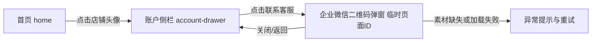

# PRD：账户侧栏联系客服展示企业微信二维码

## 一、文档信息

| 字段 | 内容 |
|------|------|
| 文档版本 | v0.1 |
| 作者 | PM Agent |
| 日期 | 2026-08-07 |
| 目标角色 | 老板账号；本需求不展开店长/店员权限划分 |
| 关联需求 | 用户从首页头像进入账户侧栏后，可通过“联系客服”查看企业微信二维码 |
| 评审状态 | 原型待制作 |

> 撰写口径：本文以业务背景、用户场景、业务规则和用户可验证结果为主体。二维码素材、客服工作时间和客服承接规则尚未提供，相关内容标记为待确认，不使用伪造二维码作为正式业务素材。

## 二、需求背景与目标

### 2.1 业务背景

卖货猫是门店日常经营工具，老板在使用货品、进货、销售和店铺设置等功能时，可能需要咨询操作方法、账号问题或平台服务。当前账户侧栏已经存在客服入口，但点击后缺少明确的企业微信承接方式，用户需要自行寻找客服联系方式，容易中断当前操作，也不利于平台持续服务和用户留存。

### 2.2 需求目标

1. 让老板从首页进入账户侧栏后，能在一个明确入口内找到平台客服。
2. 通过企业微信二维码承接咨询，减少用户寻找联系方式的步骤。
3. 展示二维码时不离开当前 App 上下文；用户关闭后仍回到账户侧栏，避免误丢失当前页面状态。
4. 保持原有账户侧栏的门店设置、店铺账户、账号安全等入口和退出账号行为不受影响。

### 2.3 成功标准

- 老板可以完成“首页头像 → 账户侧栏 → 联系客服 → 查看二维码 → 关闭返回”的完整路径。
- 二维码清晰可识别，且正式上线使用企业微信提供的有效素材。
- 二维码加载失败或素材缺失时，用户能看到明确反馈并知道下一步如何处理，不出现空白弹窗。
- 客服入口点击率、二维码展示次数和客服添加转化率可作为后续运营评估依据；具体统计口径和工具由数据规范另行确认。

## 三、用户与使用场景

| 用户 | 场景 | 诉求 |
|------|------|------|
| 老板 | 使用 App 遇到操作或服务问题 | 快速找到平台客服并添加企业微信 |
| 老板 | 从首页进入账户相关操作 | 不离开当前页面即可查看客服联系方式 |

## 四、核心业务逻辑

1. 用户点击首页顶部店铺头像，打开现有 `account-drawer`。
2. 账户侧栏展示“联系客服”入口；入口位于现有客服位置，不新增独立客服页面。
3. 用户点击“联系客服”后，弹出企业微信二维码弹窗，当前账户侧栏作为背景上下文保留。
4. 弹窗展示企业微信二维码和简短引导文案。二维码只用于识别/保存，不自动打开企业微信、不自动添加联系人、不产生订单或其他业务数据。
5. 用户关闭弹窗后返回 `account-drawer`；再次关闭账户侧栏后回到 `home`。
6. 没有二维码素材、二维码加载失败或素材不可用时，弹窗展示明确异常状态并提供“重试”；异常不影响用户继续使用账户侧栏其他功能。

## 五、需求说明

### 5.1 首页头像入口

**关联页面**：`home` 首页；**实机依据**：2026-08-07 iPhone 16 Pro、老板账号、App v1.43.6（构建 `2026072300`）。

- 保留首页顶部当前店铺头像及店铺信息布局。
- 点击头像后打开现有 `account-drawer`，不新增首页独立客服按钮。
- 头像点击行为不得影响店铺切换图标、日历入口和首页三 Tab。

### 5.2 账户侧栏客服入口

**关联页面**：`account-drawer` 店铺账户侧栏；**实机依据**：侧栏已展示门店头像、门店名、店铺编号、老板标识、到期信息及“我的客服”入口。

- 将现有客服入口的业务文案统一为“联系客服”；如产品仍需保留“我的客服”，须在评审时确认最终文案，二者不可并列展示。
- 入口沿用账户侧栏现有列表行样式：左侧客服图标、标题、右侧进入箭头、浅灰分割线。
- 入口位置保持在“关于我们”之后、“操作日志”之前，避免改变用户对侧栏的熟悉路径。
- 点击入口只打开二维码弹窗，不直接跳转外部应用。
- 账户侧栏内其他入口和“退出账号”不因本需求改变。

### 5.3 企业微信二维码弹窗

**页面ID**：`customer-service-wechat-qr`，临时页面ID，待原型评审后决定是否登记为正式页面；本期视为 `account-drawer` 的新增弹窗状态。

- 弹窗标题为“联系客服”。
- 展示一张企业微信客服二维码，二维码区域应保持足够尺寸和清晰度，不被裁切、拉伸或被其他文字遮挡。
- 二维码下方展示引导文案，建议为“长按识别二维码，添加企业微信客服”；最终文案以客服运营确认的承接方式为准。
- 弹窗提供明确关闭按钮；点击关闭后回到账户侧栏。
- 弹窗打开期间，账户侧栏和首页内容不可被误触发；返回手势或点击遮罩的行为需保持一致，并在原型评审中确认。
- 不展示虚构客服昵称、手机号、工作时间或服务承诺；这些信息未提供前不写入界面。

### 5.4 异常与状态

| 状态 | 用户可见表现 | 用户动作 |
|------|--------------|----------|
| 默认 | 弹窗展示标题、二维码和引导文案 | 长按识别/保存二维码，或关闭 |
| 加载中 | 二维码区域展示加载反馈，标题和弹窗结构保留 | 等待加载；不重复触发 |
| 加载失败 | 展示“二维码加载失败，请重试” | 点击“重试”或关闭 |
| 素材缺失/未配置 | 展示“客服二维码暂不可用”及联系平台管理员的待确认文案 | 关闭弹窗；不阻塞其他功能 |
| 关闭 | 弹窗消失，保留账户侧栏 | 继续操作侧栏或关闭侧栏 |

业务要求：异常状态不能展示空白二维码区域，也不能误导用户认为已经进入客服会话。

## 六、业务规则与边界

1. 本需求目标角色为老板账号；不新增或调整店长、店员权限规则。
2. 企业微信二维码必须由业务/客服运营提供有效素材，正式上线前完成可识别性验证。
3. 二维码素材更新后，新用户打开弹窗应展示当前有效二维码；已打开弹窗不要求热切换。
4. 二维码不可用时，不自动降级为个人微信、手机号或其他未确认联系方式。
5. 查看二维码是只读行为，不改变门店资料、库存、采购单、销售单或账号状态。
6. 用户关闭弹窗后回到账户侧栏，不默认回到首页；用户可再关闭侧栏返回首页。
7. 若企业微信二维码需要区分门店或账号，业务需提供区分规则；在规则确认前使用统一平台客服二维码。

## 七、与既有功能关联

| 既有功能 | 关系 | 影响与复用 |
|----------|------|-----------|
| `home` 首页 | 上游入口 | 复用顶部店铺头像点击行为，不改变首页主导航 |
| `account-drawer` 店铺账户侧栏 | 直接改造 | 复用现有客服列表行，新增二维码弹窗状态 |
| `store-settings` 门店设置 | 相关但不修改 | 不复用门店微信图片作为客服二维码，避免把门店资料误当平台客服素材 |
| 关于我们/账号安全/数据导出 | 同侧栏邻接功能 | 保持入口位置和行为不变 |

## 八、验收标准

1. **进入侧栏**：Given 用户位于首页，When 点击顶部店铺头像，Then 打开 `account-drawer`，并可看到“联系客服”入口。
2. **打开二维码**：Given 用户已打开账户侧栏，When 点击“联系客服”，Then 在当前侧栏上下文上展示“联系客服”二维码弹窗。
3. **二维码展示**：Given 企业微信二维码素材有效，When 弹窗加载完成，Then 展示完整清晰二维码、客服引导文案和关闭按钮。
4. **返回路径**：Given 二维码弹窗已打开，When 用户点击关闭，Then 弹窗消失并回到账户侧栏；账户侧栏其他入口仍可操作。
5. **加载反馈**：Given 二维码正在加载，When 用户查看弹窗，Then 展示加载反馈，且不出现空白或残缺二维码。
6. **失败重试**：Given 二维码加载失败，When 用户点击“重试”，Then 重新尝试加载；在重试期间保留弹窗结构。
7. **素材缺失**：Given 平台未配置二维码素材，When 用户点击“联系客服”，Then 展示“客服二维码暂不可用”等明确状态，不展示伪造二维码，且用户可以关闭弹窗。
8. **无副作用**：Given 用户查看或关闭二维码弹窗，When 返回首页，Then 门店资料、库存、进货单、销售单和账号状态均未被修改。
9. **既有功能回归**：Given 用户在账户侧栏点击门店设置、店铺账户、账号安全、关于我们、操作日志、数据导出或退出账号，When 执行原有操作，Then 行为与本需求上线前一致。

## 八点一、页面与交互补充

- 本需求复用 `home` 和 `account-drawer`，新增内容仅为 `customer-service-wechat-qr` 临时弹窗状态，不新增独立导航页面。
- 弹窗必须覆盖默认、加载中、加载失败、素材缺失和关闭返回状态；未制作 Open Design 原型不影响本 PRD 独立评审。
- 页面字段和状态以 `product-knowledge/ui/pages.md`、`product-knowledge/ui/design-system.md` 及 `product-knowledge/data-dictionary.md` 的证据规则为准。

## 九、原型与页面依据

### 9.1 页面映射

| PRD 页面ID | 页面名 | 类型 | 当前状态 |
|------------|--------|------|----------|
| `home` | 首页 | 既有页面 | 复用头像入口，已由实机观察确认 |
| `account-drawer` | 店铺账户侧栏 | 既有页面 | 改造客服入口，已由实机观察确认 |
| `customer-service-wechat-qr` | 企业微信二维码弹窗 | 临时页面ID/弹窗状态 | 待 Open Design 制作与评审 |

### 9.2 设计依据

- `product-knowledge/ui/design-system.md`：浅灰白背景、白色卡片、12-16px 圆角、红色强调色、列表行与分割线规范。
- `product-knowledge/ui/pages.md`：`home`、`account-drawer` 页面结构与导航关系。
- `product-knowledge/ui/device-observation-2026-08-07.md`：当前 iPhone 16 Pro、老板账号、v1.43.6 实机观察；账户侧栏客服入口当前文案为“我的客服”。
- 实机截图：`product-knowledge/ui/assets/observed/account-drawer-observed.jpg`。

### 9.3 Open Design 原型

| 项目 | 内容 |
|------|------|
| 原型项目 | 待制作 |
| 原型标识 | 待制作 |
| 评审状态 | 待制作 |
| 覆盖状态 | 侧栏默认态、二维码展示态、加载态、失败态、素材缺失态、关闭返回 |

## 十、待确认项

| 优先级 | 待确认内容 | 影响 |
|--------|------------|------|
| P0 | 企业微信客服二维码正式素材及有效期 | 决定弹窗能否上线 |
| P0 | 入口最终文案使用“联系客服”还是沿用实机“我的客服” | 影响页面文案和用户认知 |
| P1 | 是否使用统一平台客服二维码，还是按门店/账号展示不同二维码 | 影响客服分流规则 |
| P1 | 二维码下方引导文案、客服工作时间和客服承接承诺 | 影响弹窗内容 |
| P1 | 点击遮罩或系统返回键是否关闭弹窗 | 影响交互一致性 |

## 十一、版本范围

### MVP

- 复用首页头像和账户侧栏。
- 提供“联系客服”入口。
- 展示企业微信二维码弹窗。
- 覆盖加载、失败、素材未配置、关闭返回等状态。
- 不修改账户侧栏其他功能，不改变任何业务数据。

### 后续可选

- 客服二维码按门店、账号或服务类型分流。
- 展示客服工作时间、服务说明或多个客服入口。
- 记录客服入口到二维码识别的运营转化数据。

## 十二、风险与依赖

| 风险/依赖 | 等级 | 影响与应对 |
|---|---|---|
| 企业微信二维码素材未提供或过期 | 高 | 无法上线有效客服承接；上线前由业务/客服运营提供并验证素材有效期 |
| 入口文案与实机“我的客服”不一致 | 中 | 影响用户认知；评审时确认最终文案并同步页面知识库 |
| 二维码展示指标口径未确认 | 低 | 暂不承诺目标值；按 `product-knowledge/metrics.md` 建立口径后再评估 |
