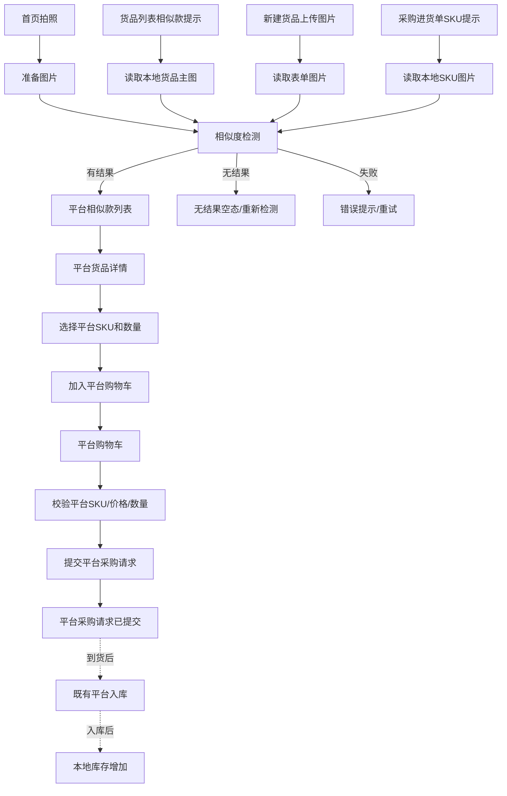
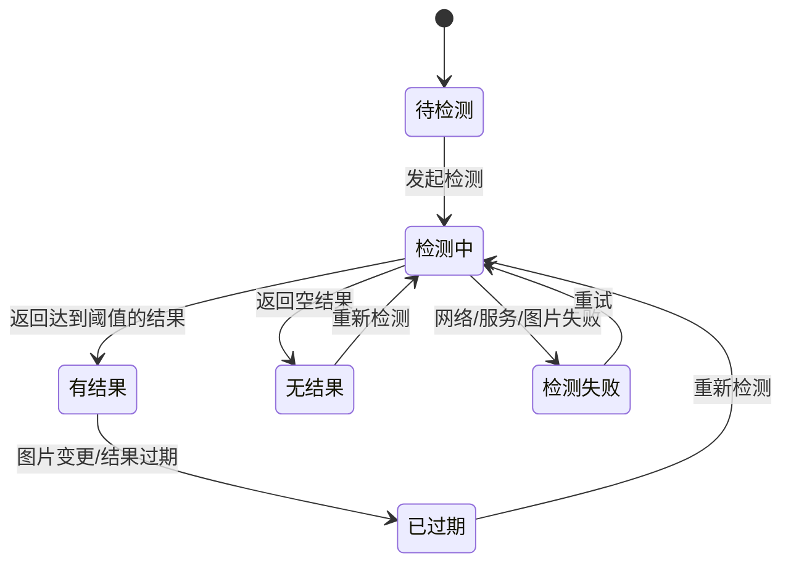

# PRD：平台相似款推荐与平台采购

## 一、文档信息

| 字段 | 内容 |
|------|------|
| 文档版本 | v1.0 |
| 作者 | PM Agent |
| 日期 | 2026-08-07 |
| 关联需求 | 在卖货猫零售 ERP 内识别门店货品与平台货品的相似款，并支持直接加入平台购物车提交采购 |
| 目标角色 | 老板账号；本项目不展开店长/店员权限矩阵 |
| 评审状态 | 原型待评审 |

> 证据说明：现有页面和交互的**设计依据**为 `product-knowledge/ui/pages.md`、`ui/design-system.md`；当前界面和入口的**实机依据**为 2026-08-07 iPhone 16 Pro 老板账号观察。相似度算法、平台商品目录和平台订单接口目前没有实机证据，本文将其标记为业务/技术待确认项。

> 撰写口径：本文以业务背景、用户场景、核心业务逻辑和需求说明为主体；具体技术方案不作为产品验收内容。

## 二、背景与目标

### 2.1 背景

卖货猫当前支持本平台货品入库，也支持其他厂商货品通过进货入库进入门店库存。门店用户在新增货品、查看货品或创建进货单时，已经持有真实的款式图片和 SKU 信息，但当前无法快速发现卖货猫平台内是否存在相似货品，平台货品采购入口与 ERP 的日常操作链路也未打通。

本需求通过图片相似检索，把门店用户的真实货品需求连接到平台货品目录：当用户上传或选择一款货品后，系统识别平台内相似款，提示相似度，并支持查看平台货品详情、加入平台购物车和提交平台采购请求。

### 2.2 目标

1. 在用户已有的拍照、货品管理和进货单操作中提供平台相似款发现能力。
2. 让用户从相似款结果直接完成平台货品选择和平台采购请求提交，减少跨系统查找成本。
3. 不改变其他厂商入库链路，不将平台采购请求误记为本地库存入库。
4. 建立可衡量的转化漏斗：相似款曝光 -> 相似款点击 -> 加入平台购物车 -> 提交平台采购请求 -> 后续平台入库。

### 2.3 核心业务逻辑

1. 用户在首页拍照、货品列表、新建货品或进货单中提供一款本地货品作为参考。
2. 系统判断平台是否存在相似款；有结果时告诉用户“存在相似款”，并展示相似度和可采购信息。
3. 用户查看平台相似款列表，进入平台货品详情，选择具体颜色/尺码和数量后加入平台购物车。
4. 用户在购物车确认平台货品和采购数量，提交平台采购请求。
5. 提交成功只代表采购请求已发出，不代表本地已经入库；货品到货后仍通过既有平台入库流程增加本地库存。
6. 任一检测失败、没有相似款或平台货品不可采购时，用户仍可继续原来的本地建款、进货和库存操作。

### 2.4 非目标

- 本期不改变现有 `purchase-create` 的其他厂商入库、扫码入库、拍照入库和一手货源入库逻辑。
- 本期不改变平台采购请求提交时的本地库存；提交成功不直接增加门店库存、不自动生成本地进货单。
- 本期不实现复杂的推荐排序、个性化推荐、销量预测、智能补货数量建议或自动替用户下单。
- 本期不定义支付、发货、售后、退款和平台订单履约流程；平台采购请求提交后的履约状态以平台订单系统后续能力为准。
- 本期不改造采购进货页的 `replenishment-tab`。该页面是平台货品/其他货品处理功能，与后续 SKU 补货采购请求不是同一功能。
- 本期不实现或复用 `08-replenishment` 的 SKU 补货采购请求；本需求的“平台采购”是独立的平台商品采购闭环。
- 本期不展开店长/店员权限划分，默认以老板账号为目标角色。

## 三、用户与场景

| 用户角色 | 使用场景 | 核心诉求 |
|---------|---------|---------|
| 老板/门店经营者 | 看到市场款式或客户上传款式，想快速找平台货源 | 拍照即可找到可采购的相似款 |
| 老板/门店经营者 | 新建本地货品时上传图片 | 不离开建款流程，判断平台是否已有相近货源 |
| 老板/门店经营者 | 查看门店货品列表 | 发现已有门店货品对应的平台相似款 |
| 老板/门店经营者 | 创建采购进货单并添加 SKU | 针对当前采购 SKU 直接查看平台替代/相似货品并提交采购 |

> “客户新增采购单”在本文解释为卖货猫门店客户/用户创建 `purchase-create` 进货单，不是 `customer-list` 中的会员创建消费订单。如业务实际指会员采购订单，需要另行拆分订单模型。

## 四、功能需求

### 4.1 功能总览

| 编号 | 功能点 | 优先级 | 迭代 | 说明 |
|------|--------|--------|------|------|
| F1 | 平台货品目录与相似度检测服务 | Must | MVP | 接收门店货品图片，返回平台可采购相似款和相似度 |
| F2 | 首页拍照查找相似款 | Must | MVP | 从 `home` 发起拍照/上传图片检索 |
| F3 | 货品列表相似款提示 | Must | MVP | 在 `goods-list` 的本地货品卡片展示提示并跳转结果 |
| F4 | 新建货品图片检测 | Must | MVP | 在 `goods-create` 上传图片后检测，不阻塞保存 |
| F5 | 采购进货单 SKU 检测 | Must | MVP | 在 `purchase-create` 的货品行提示相似款 |
| F6 | 相似款列表与平台货品详情 | Must | MVP | 展示图片、相似度和平台货品信息，支持进入详情 |
| F7 | 平台购物车 | Must | MVP | 跨入口汇总平台 SKU，支持修改数量和删除 |
| F8 | 提交平台采购请求 | Must | MVP | 校验平台 SKU 和价格后提交采购数据，不改变本地库存 |
| F9 | 平台采购与平台入库衔接 | Should | 后续 | 平台到货后继续使用既有平台入库能力；是否自动关联订单待定义 |
| F10 | 多图匹配、推荐排序和运营配置 | Could | 后续 | 扩展多图片、排序策略、阈值和平台运营配置 |

### 4.2 F1 平台货品目录与相似度检测

#### 功能描述

建立图片相似度检测能力，将门店本地货品图片与平台货品目录进行匹配，返回可展示的相似平台货品。相似度检测是四个入口共用的能力，不在各页面重复实现。

#### 业务规则

- 检测输入至少包含一张有效货品图片；无图片时不发起检测。
- 平台货品结果必须包含平台货品 ID、至少一个可采购 SKU、主图、货品名称、款号、可售价格和相似度。
- 相似度范围为 `0-100%`，列表按相似度从高到低排列；页面展示百分比，原始分数用于排序和审计。
- 只展示满足平台可采购条件的货品。具体条件（上架状态、库存、预售或可下单状态）需由平台商品中心确认，不能由客户端自行推断。
- 相似度阈值由平台配置或服务端返回；客户端不得写死阈值。低于阈值的结果不展示为“相似款”。
- 同一门店货品、同一采购单 SKU 的重复检测应复用有效结果，避免页面反复请求；结果过期后允许重新检测。
- 检测结果必须记录来源场景：`home_camera`、`goods_list`、`goods_create`、`purchase_create`。

#### 状态

`待检测 -> 检测中 -> 有结果 / 无结果 / 检测失败`

- `待检测`：图片已准备但尚未发起请求。
- `检测中`：展示加载状态，禁止重复发起相同请求。
- `有结果`：返回至少一个达到阈值的可采购平台货品。
- `无结果`：请求成功但没有达到阈值的可采购结果。
- `检测失败`：网络、服务或图片处理失败，可重试。

#### 边界与异常

- 图片格式、大小或清晰度不满足平台要求时，提示具体原因，并允许重新选择图片。
- 网络异常时保留用户当前页面内容，不阻塞本地货品保存或进货单编辑；提供“重试”。
- 结果中的平台货品已下架、不可采购或价格失效时，打开列表/购物车时重新校验并移除或标记不可提交。
- 同一图片短时间重复检测不得重复计入有效请求和转化漏斗。

#### 验收标准

- Given 用户提供有效货品图片且平台服务正常，When 发起相似度检测，Then 页面展示检测中状态，并在完成后进入有结果或无结果状态。
- Given 平台返回多个结果，When 展示相似款列表，Then 结果按相似度降序排列，并展示每个结果的相似度百分比。
- Given 平台货品未达到服务端配置阈值，When 检测完成，Then 该货品不出现在相似款结果中。
- Given 检测失败，When 用户点击重试，Then 使用同一图片重新检测，页面不重复生成相似款或购物车数据。

### 4.3 F2 首页拍照查找相似款

#### 功能描述

在 `home` 首页货品卡片区域新增“拍照找相似款”入口，复用首页数据卡片和红色胶囊快捷操作范式。点击后进入新增的拍照/上传页面，完成图片采集后进入相似款列表。

#### 业务规则

- 入口位于首页货品卡片附近，与“建款”“详情 >”保持同一模块上下文。
- 入口使用相机图标 + 短文案“拍照找相似款”；具体布局以设计评审为准，不能挤压现有卡片数据或遮挡“更多功能”悬浮按钮。
- 首次使用时请求相机/相册权限；拒绝权限时提供相册选择入口，并提示用户可在系统设置开启权限。
- 拍照或选择图片成功后立即进入检测流程；用户可以取消，不产生本地货品或采购单。

#### 验收标准

- Given 用户打开 `home`，When 查看货品卡片，Then 可看到“拍照找相似款”入口且不影响原有“建款”“详情 >”入口。
- Given 用户点击拍照入口并授权相机，When 拍摄并确认图片，Then 进入相似度检测并在完成后打开相似款列表。
- Given 用户拒绝相机权限，When 继续操作，Then 页面提供选择本地图片的替代路径，不出现不可恢复的空白页。

### 4.4 F3 货品列表相似款提示

#### 功能描述

在 `goods-list` 本地货品卡片中展示已有有效检测结果的“存在平台相似款”提示。用户点击提示后，使用该本地货品图片打开相似款列表。

#### 业务规则

- 提示只针对有有效图片和有效检测结果的本地货品显示；没有结果时不显示空提示。
- 对已有但尚无检测结果的本地货品，首次进入 `goods-list` 时可对当前可见且有图片的货品异步触发按需检测；检测不阻塞列表浏览，结果返回后更新对应卡片。批量全量检测策略属于平台技术方案待确认项。
- 提示至少包含“存在平台相似款”和结果数量或“查看”动作，不展示过长文案。
- 提示显示在现有双列货品卡片的可用信息区，不改变图片、款号、名称、价格和货品类型的既有位置。
- 用户点击卡片主体仍进入本地 `goods-detail`；点击相似款提示才进入平台相似款列表。
- 本地货品停用、图片变化或检测结果过期后，提示失效并允许重新检测。

#### 验收标准

- Given 本地货品存在达到阈值的有效检测结果，When 打开 `goods-list`，Then 对应货品卡片展示平台相似款提示。
- Given 历史货品有主图但没有有效检测结果，When 首次进入 `goods-list`，Then 对当前可见货品异步触发检测，列表仍可正常滚动，结果返回后更新卡片。
- Given 用户点击货品卡片主体，When 进入详情，Then 仍进入本地 `goods-detail`，不改变原有导航。
- Given 用户点击相似款提示，When 跳转完成，Then 打开与该本地货品关联的相似款列表，并保留来源货品信息。

### 4.5 F4 新建货品图片检测

#### 功能描述

在 `goods-create` 上传货品图片后触发相似度检测。检测提示显示在图片/常规信息区域附近，不阻塞“保存”或“保存并继续新增”。

#### 业务规则

- 现有新建货品最多支持 10 张图片；MVP 默认使用首张主图进行检测。多图合并匹配作为后续能力，除非技术方案可以无成本支持。
- 图片上传成功后显示“正在查找平台相似款”；有结果时显示“发现平台相似款，查看”；无结果时不打扰用户继续录入。
- 用户点击提示进入相似款列表；列表返回后保留新建货品表单内容。
- 用户替换或删除主图时，旧检测结果不可继续绑定到新图片；需要重新检测。
- 查看平台相似款不会自动替换本地货品字段、供应商、进价、售价、会员价或库存。
- 用户可以先查看/采购平台货品，再返回继续保存本地货品。

#### 验收标准

- Given 用户在 `goods-create` 成功上传主图，When 图片处理完成，Then 开始检测并展示检测状态，不阻塞表单编辑。
- Given 检测得到平台相似款，When 用户点击提示，Then 打开相似款列表，返回后图片和已填写表单内容保持不变。
- Given 用户未等待检测完成，When 点击“保存”，Then 本地货品仍可按原有流程保存，检测失败不影响本地建款。
- Given 用户更换主图，When 再次查看相似款，Then 结果必须对应新主图，不得复用旧图片的结果。

### 4.6 F5 采购进货单 SKU 检测

#### 功能描述

在 `purchase-create` 的本地进货单货品明细中，对有图片的门店货品进行平台相似款检测。检测结果以 SKU 行级提示呈现，用户点击后查看平台相近款并可加入平台购物车。

#### 业务规则

- 本功能影响的是 `purchase-create` 中的本地进货单草稿，不替换既有“扫码入库”“选择货品”“拍照入库”入口。
- 用户通过扫码、选择货品或拍照入库添加货品后，若能获得本地货品图片，则可以发起检测。
- 每个采购单货品行独立显示检测状态；一个 SKU 检测失败不得阻塞其他 SKU 或进货单保存。
- 点击提示进入相似款列表时，必须带上采购单草稿 ID、来源 SKU ID 和当前数量，但不能自动把平台货品加入本地进货单。
- 平台购物车提交和本地进货单“确定”是两个独立动作：平台采购提交不等于本地入库提交。

#### 验收标准

- Given `purchase-create` 已添加带图片的本地 SKU，When 检测完成且存在相似款，Then 该 SKU 行展示“存在平台相似款”提示。
- Given 用户点击某 SKU 的相似款提示，When 打开列表，Then 列表上下文显示来源款号/来源 SKU，且平台货品操作不会修改本地进货单数量。
- Given 某 SKU 检测失败，When 用户继续编辑进货单，Then 其他 SKU 和原有进货单操作不受影响。
- Given 用户提交平台采购请求，When 返回成功，Then 本地进货单仍保持原状态，不能被自动标记为已入库。

### 4.7 F6 相似款列表与平台货品详情

#### 页面说明

当前 `ui/pages.md` 没有平台相似款页面。以下页面ID为本需求建议的新页面ID，开发前需补充到页面注册表：

| 建议页面ID | 页面名 | 页面类型 | 说明 |
|---|---|---|---|
| `platform-similar-camera` | 拍照查找相似款 | 新增页面，待注册 | 拍照/选图和检测前状态 |
| `platform-similar-list` | 平台相似款列表 | 新增页面，待注册 | 展示相似度和平台货品卡片 |
| `platform-goods-detail` | 平台货品详情 | 新增页面，待注册 | 展示平台可采购 SKU 和加入购物车 |
| `platform-cart` | 平台购物车 | 新增页面，待注册 | 汇总平台 SKU 并提交采购 |

> 以上四个页面均待注册，当前不能视为 App v1.43.6 已存在页面。

> `replenishment-prototype` 是 Open Design 项目标识，不是 App 页面ID；`platform-purchase-success` 是本 PRD 的临时结果状态，未评审确认前不得注册为正式页面。

#### 相似款列表

- 页面顶部显示返回按钮、标题“平台相似款”，并在右侧显示平台购物车入口和数量角标。
- 页面顶部或标题下显示来源上下文，例如“来自款号 S9167”或“本次拍摄图片”；没有来源时显示“拍照查找结果”。
- 结果采用与 `goods-list` 一致的货品双列卡片范式，展示平台货品主图、货品名称、款号、可采购价格和“相似度 XX%”。
- 相似度使用明显但不过度抢占图片的标签/徽章展示；卡片点击进入 `platform-goods-detail`。
- 列表默认按相似度降序；分页、加载更多和结果数量以平台服务能力为准。
- 空态显示“暂未找到相似平台货品”，提供重新拍摄/重新选择图片；不能展示空白列表。
- 加载态保留页面结构并显示加载反馈；错误态提供重试，不清除来源图片。

#### 平台货品详情

- 展示平台货品图片、名称、款号、相似度来源、平台售价/采购价、可采购 SKU、颜色、尺码和可采购状态。
- 若平台货品需要选择颜色/尺码，用户必须先选择 SKU，再填写数量；不允许只按款式加入无法履约的购物车项。
- 底部使用固定操作区域，主按钮为“加入购物车”；数量使用步进器或输入框，最小值为 1 的整数。
- 平台价格和可采购状态在详情打开或加入购物车时校验；失效时提示并禁止加入。
- 平台货品详情不能复用本地 `goods-detail` 的库存记录、停用、编辑、打印标签等本地货品操作。

#### 验收标准

- Given 相似款列表存在多个平台结果，When 打开页面，Then 每张卡片展示图片、平台货品基本信息和相似度，并按相似度降序排列。
- Given 用户点击平台货品卡片，When 进入详情，Then 展示可采购 SKU 选择和“加入购物车”，不出现本地货品的停用/编辑操作。
- Given 平台 SKU 已不可采购，When 用户进入详情或加入购物车，Then 系统提示不可采购并阻止加入。
- Given 没有达到阈值的结果，When 检测完成，Then 展示无结果空态和重新检测入口。

### 4.8 F7 平台购物车

#### 功能描述

提供跨四个入口共享的平台购物车，用于汇总平台货品 SKU，支持数量管理和提交平台采购请求。该购物车独立于 `replenishment-tab` 的购物车。

#### 业务规则

- 购物车归属当前登录账号和当前门店；从相似款列表进入其他页面后，已加入的平台 SKU 保留。
- 购物车行以平台 SKU 为最小单位，展示平台货品图、名称、款号、颜色、尺码、采购价、数量和小计。
- 同一平台 SKU 再次加入时累加数量；不同规格必须拆为不同购物车行。
- 支持修改数量、删除单行、清空购物车；数量必须为大于等于 1 的整数。
- 平台价格发生变化时，在打开购物车或提交时重新校验并展示价格变化；用户确认前不提交旧价格。
- 平台 SKU 不可采购时标记异常，不计入可提交金额，并要求用户移除或替换后才能提交。
- 底部固定汇总 SKU 行数、总件数、预计采购金额和“提交采购”按钮，沿用现有 `checkout` 的底部固定操作栏范式。
- 购物车为空时展示空态和“去找相似款”入口。

#### 验收标准

- Given 用户从任一相似款入口加入平台 SKU，When 打开平台购物车，Then 可看到该 SKU 及来源无关的统一购物车数据。
- Given 同一平台 SKU 再次加入，When 确认加入，Then 对应购物车行数量累加，不生成重复行。
- Given 购物车存在不可采购 SKU，When 用户点击提交采购，Then 提交被阻止并明确指出异常行。
- Given 用户修改数量或删除行，When 操作完成，Then SKU 行数、总件数和预计采购金额同步更新。

### 4.9 F8 提交平台采购请求

#### 功能描述

用户在平台购物车确认货品、SKU、数量和金额后，向平台提交采购数据，生成平台采购请求。提交成功后展示结果，购物车仅在服务端确认成功后清空。

#### 业务规则

- 提交前展示确认信息：平台 SKU 行数、总件数、预计采购金额和当前门店。
- 提交时服务端重新校验平台 SKU 可采购状态、价格、数量和账号/门店上下文。
- 提交成功生成平台采购请求/订单编号（编号规则由平台订单系统提供），展示成功结果和后续查看入口；若平台暂不返回订单编号，至少返回提交成功状态。
- 提交成功不增加本地库存、不生成 `purchase-create` 本地入库单、不改变已有进货单状态。
- 提交失败时保留购物车内容，允许重试；重复点击不得生成重复平台采购请求。
- 本期不在 ERP 内完成支付；是否需要支付、支付入口和订单履约状态属于平台订单系统后续范围。
- 平台到货后，仍通过既有平台入库能力增加库存；平台采购请求与本地入库的自动关联列为后续迭代。

#### 状态

`购物车 -> 提交中 -> 已提交 / 提交失败`

仅 `已提交` 才能清空对应购物车。`提交失败` 保留购物车并允许重试。

#### 验收标准

- Given 购物车内全部 SKU 可采购且价格有效，When 用户确认提交，Then 按钮进入提交中状态并防止重复点击。
- Given 平台服务返回成功，When 提交完成，Then 展示平台采购请求提交成功结果，购物车清空，本地库存和本地进货单不变。
- Given 平台服务返回失败，When 提交完成，Then 展示失败原因，购物车内容保留，用户可重试。
- Given 提交请求超时后用户重试，When 服务端已存在同一请求，Then 不生成重复采购请求，并返回原提交结果或明确处理中状态。

## 五、流程设计

### 5.1 统一用户流程

### 5.2 检测状态流转

## 六、页面与交互

### 6.1 现有页面改造

| 页面ID | 页面名 | 改造类型 | 交互说明 | 依据 |
|--------|--------|---------|---------|------|
| `home` | 首页 | 增加入口 | 在货品卡片附近增加相机图标 + “拍照找相似款”快捷入口；保留“建款”“详情 >” | 实机观察：首页四数据卡片和红色快捷按钮；目标设计：快捷操作范式 |
| `goods-list` | 货品列表 | 增加提示 | 在本地货品双列卡片的信息区增加“存在平台相似款”徽章/文字入口；卡片主体原导航不变 | 实机观察：分类侧栏 + 双列货品卡片 |
| `goods-create` | 新建货品 | 增加检测反馈 | 图片上传后在图片区或常规信息区展示检测中、发现相似款和失败重试；不阻塞保存 | 实机观察：最多 10 张图片、保存/继续新增、未保存拦截 |
| `purchase-create` | 新建入库单 | 增加 SKU 提示 | 本地进货单货品行展示相似款检测状态和入口；不改变扫码/选货/拍照入库和确定动作 | 实机观察：供应商、日期、备注、三种添加货品方式 |

### 6.2 新增页面

以下页面当前未注册到 `ui/pages.md`，上线前必须补充页面注册和设计快照。页面应采用现有顶部返回/标题、白底分组、列表卡片、红色主按钮和底部固定操作栏范式。

#### `platform-similar-camera`：拍照查找相似款

- 顶部返回按钮、标题“拍照找相似款”。
- 中部提供拍照、从相册选择和重新拍摄操作；展示当前图片预览。
- 底部红色主按钮“查找相似款”；图片未准备好时禁用。
- 相机权限拒绝、图片读取失败、图片格式不支持时展示可恢复错误状态。

#### `platform-similar-list`：平台相似款列表

- 顶部返回、标题、平台购物车图标和数量角标。
- 来源上下文区域展示来源图片缩略图、来源款号或“本次拍摄图片”。
- 主体沿用 `goods-list` 双列货品卡片：图片、平台货品名称、款号、价格、相似度标签。
- 支持加载、空态、错误重试和分页/加载更多。
- 点击卡片进入 `platform-goods-detail`；点击购物车进入 `platform-cart`。

#### `platform-goods-detail`：平台货品详情

- 展示平台货品图片、名称、款号、相似度、采购价格、可采购 SKU 和可选颜色/尺码。
- 使用 SKU 选择器和数量控件，底部固定“加入购物车”。
- 不展示本地货品的库存记录、停用、编辑、打印标签操作。

#### `platform-cart`：平台购物车

- 顶部返回、标题“平台购物车”、清空入口和购物车行数。
- 主体展示平台 SKU 行：图片、名称、款号、颜色、尺码、价格、数量和删除。
- 底部固定 SKU 行数、总件数、预计采购金额和“提交采购”。
- 提交前弹出确认层；提交中禁用按钮；失败后保留购物车。

### 6.3 页面状态统一要求

| 状态 | 要求 |
|------|------|
| 默认 | 展示当前来源、图片或货品上下文及可用操作 |
| 加载 | 保留页面结构，展示检测/平台数据加载状态，禁止重复提交 |
| 空态 | 明确“未找到相似平台货品”或“购物车为空”，提供下一步操作 |
| 禁用 | 无图片、无可采购 SKU、购物车存在异常行时禁用对应主按钮，并说明原因 |
| 错误 | 展示可理解的失败原因和重试，保留用户已填数据 |
| 价格变化 | 购物车或提交时提示价格变更，用户确认后才能继续 |
| 权限/系统能力 | 以老板账号为目标；相机和相册权限由系统授权状态决定 |

### 6.4 Open Design 原型记录

| 字段 | 内容 |
|------|------|
| 原型工具 | Open Design |
| Open Design 项目 | `replenishment-prototype` |
| 原型文件 | `platform-similar-purchase.html` |
| 原型标识 | `od://app/api/projects/replenishment-prototype/raw/platform-similar-purchase.html?workspaceId=w9ueo9qukk1hikfvn38wd2n1&workspaceMemberId=thu39dw39om6ocn2rbafap5k` |
| 原型状态 | 已生成，待产品/设计评审 |
| 原型记录 | `product-knowledge/ui/prototypes/2026-08-07-platform-similar-purchase.md` |

页面映射和评审结果以原型记录为准。当前原型已覆盖首页入口、拍照检测、平台相似款列表、货品列表提示、新建货品检测、进货单 SKU 提示、平台货品详情、平台购物车和提交结果。`platform-purchase-success` 仅作为本次原型的结果状态，是否独立注册为页面待评审确认。

## 七、业务信息与效果衡量

本章优先说明用户和业务需要看到、确认和沉淀的信息。具体接口、表结构和技术字段不属于本 PRD 的产品验收范围，必要内容仅作为开发参考。

### 7.1 业务对象与口径

| 业务对象 | 用户/业务需要关心的信息 | 业务口径 |
|---------|------------------------|---------|
| 本地参考货品 | 图片、名称、款号、颜色/尺码、库存 | 用户当前想找相似款的门店货品或采购 SKU |
| 平台相似款 | 图片、平台名称、平台款号、相似度、可采购颜色/尺码、平台供货价 | 只有达到展示条件且当前可采购的货品才进入结果和购物车 |
| 平台购物车 | 已选平台款、SKU、数量、预计金额、异常提示 | 同一平台 SKU 合并数量；不可采购或价格变化时必须提示用户处理 |
| 平台采购请求 | 请求编号、提交状态、货品、数量、预计金额 | 提交成功代表采购请求已发出，不代表本地已入库 |

### 7.2 技术实现参考（可选）

以下内容不在本 PRD 展开。研发需要时，另行补充平台商品、相似度结果、购物车和采购请求的数据方案；数据方案必须以本 PRD 已确认的业务规则为准。

### 7.3 效果衡量参考（可选）

业务侧重点关注：相似款入口曝光、检测完成率、相似款点击率、加入购物车率、平台采购请求提交率，以及提交后平台入库转化。具体埋点事件和参数由数据方案另行定义。

## 八、与既有功能的关联

| 关联功能 | 关联类型 | 影响说明 |
|---------|---------|---------|
| 货品管理（`goods-list`、`goods-detail`、`goods-create`） | 上游数据 + 页面改造 | 复用本地货品图片、款号和 SKU；新增相似款提示，不改变本地货品字段和库存 |
| 进货入库（`purchase-create`、`purchase-list`） | 上游场景 + 平行采购 | 在进货单 SKU 行提供平台相似款入口；平台采购提交不等同于本地入库 |
| 首页（`home`） | 新增快捷入口 | 复用首页货品卡片、红色胶囊快捷操作和更多功能悬浮入口范式 |
| 供应商管理 | 业务边界 | 其他厂商供应商和平台货品来源并行；平台采购不创建普通供应商记录 |
| 库存与经营分析 | 下游影响 | 平台采购提交不增加库存；平台到货并完成既有入库后，才进入库存和经营分析口径 |
| 采购进货补货单 Tab（`replenishment-tab`） | 明确隔离 | 不复用该页面购物车、实体或未处理/已处理/已失效状态；也不复用 `08-replenishment` 的 SKU 补货采购请求模型 |
| 扫码/拍照/图片能力 | 公共能力复用 | 首页拍照、货品图片、进货单拍照复用图片和权限能力；相似度服务作为新增能力接入 |

## 九、权限与业务安全

- 本项目以老板账号为目标角色，不扩展店长/店员权限矩阵。
- 相机和相册权限仅用于用户主动发起拍照/选图；用户拒绝权限时提供替代路径。
- 结果列表只展示当前门店可以采购的货品，避免用户看到无法下单的推荐。
- 平台采购请求必须明确当前门店，防止用户误提交到其他门店。
- 提交前需要再次确认价格、可采购状态和数量；价格或状态变化时，必须让用户处理后再提交。
- 本地货品图片的使用范围、保存期限和用户授权文案，需要在上线前确认。

## 十、迭代规划

| 迭代 | 范围 | 目标 |
|------|------|------|
| MVP | F1-F8：检测服务、四个入口、相似款列表、平台货品详情、购物车、提交采购 | 打通“发现相似款 -> 平台采购请求提交”闭环，不改变本地库存 |
| 迭代 1 | 结果缓存和过期策略、平台采购请求查询、提交结果查看、平台价格/库存实时同步 | 提升重复操作效率和采购可追踪性 |
| 迭代 2 | 平台采购请求与到货入库关联、自动带入平台入库、订单履约状态同步 | 打通“平台采购 -> 平台入库 -> 本地库存”闭环 |
| 后续 | 多图融合、运营配置相似度阈值、推荐排序、采购数量建议、个性化推荐 | 提升匹配质量和平台转化 |

## 十一、风险与依赖

| 风险/依赖 | 等级 | 影响 | 应对 |
|-----------|------|------|------|
| 平台货品目录缺少稳定图片、SKU、价格或可采购状态 | 高 | 无法返回可执行的相似款 | 先确定平台商品中心字段和同步机制；接口缺字段时结果不可进入购物车 |
| 相似度误判导致用户反感或采购错误 | 高 | 降低信任，影响平台转化 | 服务端阈值配置、展示相似度、提供“不感兴趣/返回”路径；监控点击和提交转化 |
| 平台价格或库存变化 | 高 | 购物车提交失败 | 购物车打开和提交双重校验，失败保留购物车 |
| 新增页面未纳入现有页面注册 | 中 | 设计和开发遗漏 | 开发前补充 `ui/pages.md` 页面ID、快照和导航关系 |
| 平台采购提交与现有平台入库关系不清 | 高 | 用户误以为已入库 | 提交成功明确“不增加本地库存”；后续单独定义订单到入库关联 |
| 图片处理和传输合规 | 中 | 产生隐私和合规风险 | 明确用户授权、保存期限、脱敏埋点和服务端访问控制 |
| 图片检测耗时影响建款/进货操作 | 中 | 用户放弃或阻塞主流程 | 异步检测、非阻塞提示、缓存有效结果、失败可重试 |

## 十二、假设与待确认项

以下事项当前知识库没有确认，本 PRD 采用的方案是可落地假设，不得视为已确认业务规则：

1. “客户新增采购单”指卖货猫门店用户在 `purchase-create` 新增本地进货单；若指会员订单，需要新增独立订单模型。
2. 平台是否存在统一商品中心，以及平台货品的可采购状态、价格、SKU、库存/可售数量字段，需要平台技术确认。
3. 相似度算法、接口响应时间、服务端阈值、结果有效期和图片支持规格，需要算法/平台技术确认。
4. 相似度展示精度暂按页面展示整数百分比，原始分数保留用于排序；精度和舍入规则需要确认。
5. MVP 以首张主图检测；是否支持最多 10 张图片融合检测需要技术评估。
6. 平台采购提交是否需要支付、联系人、收货地址、运费、税费等字段，本期先按“提交采购数据”处理，待平台订单系统确认。
7. 平台采购请求提交后是否返回订单编号，以及平台订单查询入口，需要平台订单系统确认。
8. 平台采购请求与平台到货入库的自动关联不属于 MVP，后续再定义。

## 十三、验收清单

- [ ] `home` 提供“拍照找相似款”入口，原有首页货品卡片操作不受影响。
- [ ] 首页拍照/相册选图可完成检测，并覆盖加载、无结果、失败重试和权限拒绝状态。
- [ ] `goods-list` 本地货品卡片可展示平台相似款提示，卡片主体原导航不变。
- [ ] `goods-create` 上传主图后异步检测，不阻塞保存和继续新增。
- [ ] `purchase-create` 货品行可展示相似款提示，检测失败不阻塞本地进货单。
- [ ] 相似款列表展示平台货品图片、名称、款号、价格和相似度，并按相似度降序排列。
- [ ] 平台货品详情支持选择可采购 SKU、颜色/尺码和数量，并可加入平台购物车。
- [ ] 平台购物车跨四个入口共享，支持修改数量、删除、清空和异常 SKU 提示。
- [ ] 平台购物车提交前重新校验价格、可采购状态和数量。
- [ ] 提交成功后生成平台采购请求结果并清空购物车；提交失败保留购物车。
- [ ] 平台采购提交不增加本地库存、不生成本地进货单、不改变本地进货单状态。
- [ ] 其他厂商入库、扫码入库、拍照入库、一手货源入库等既有流程回归通过。
- [ ] 新增页面ID已补充至 `product-knowledge/ui/pages.md`，并完成页面快照和导航关系更新。
- [ ] 相似度服务、平台商品目录、平台购物车和平台采购请求接口完成联调。
- [ ] 关键埋点可统计曝光、检测结果、详情点击、加购和提交成功/失败。
