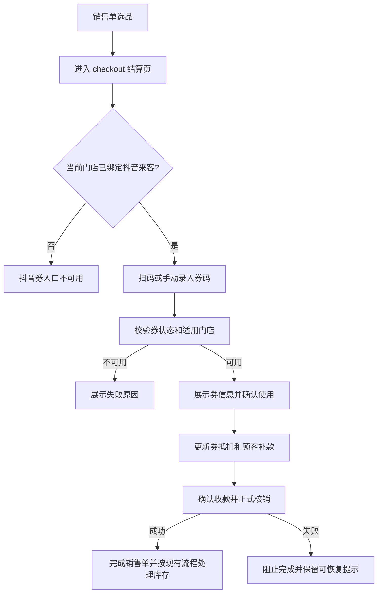

# PRD：抖音来客店铺绑定与结算页券码核销

## 一、文档信息

| 字段 | 内容 |
|------|------|
| 文档版本 | v2.0 |
| 作者 | PM Agent |
| 日期 | 2026-08-12 |
| 关联需求 | 收敛抖音券能力范围：绑定抖音来客店铺，并在新增销售单的结算页支持抖音券码核销 |
| 评审状态 | 待评审 |
| 修订说明 | 基于 2026-08-10 初版，移除独立验券、团购商品映射、核销记录/对账、撤销核销等本期范围 |

## 二、背景与目标

### 2.1 背景

卖货猫已有销售开单和结算流程，但尚未接入抖音来客店铺及抖音券核销。门店当前需要在抖音来客和卖货猫之间切换，完成券码判断、收款和销售开单，容易造成核销重复、收款方式记录错误以及销售单与实际货品不一致。

### 2.2 本期目标

1. 支持老板账号将当前卖货猫门店绑定至对应的抖音来客店铺及门店 POI。
2. 在新增销售单的 `checkout` 结算页录入抖音券码，完成券码校验、选择抵扣和正式核销。
3. 将抖音券抵扣与顾客补款分开展示，并沿用现有销售单、收款和库存处理口径。
4. 在核销失败、券不可用或网络异常时阻止错误收款，并给出可恢复反馈。

### 2.3 非目标

- 不在本期建设抖音来客团购商品创建、编辑、上架或商品映射能力。
- 不新增独立的抖音验券页；券码仅在销售单 `checkout` 结算页处理。
- 不建设抖音券核销记录、对账报表、撤销核销和售后联动页面。
- 不支持多张抖音券合并、抖音买单、次卡、多次核销、预约类券及复杂套餐。
- 不改造卖货猫现有会员营销优惠券体系；抖音券与本地优惠券保持独立。
- 不扩展店长/店员权限矩阵，默认目标角色为老板账号。

## 三、用户与场景

| 用户角色 | 使用场景 | 核心诉求 |
|---------|---------|---------|
| 老板账号 | 首次接入抖音来客 | 完成当前门店与抖音门店 POI 绑定 |
| 门店操作人员 | 顾客使用抖音券购买货品 | 在正常开单结算流程中快速核销并收取补款 |
| 老板账号 | 处理核销失败或绑定异常 | 查看明确原因，不产生错误销售结果 |

### 3.1 典型流程

顾客到店后选择本地货品。店员在 `sales-create` 完成选品，进入 `checkout`，扫描或手动输入抖音券码，系统校验券状态和当前门店，店员确认使用该券后完成顾客补款，点击确认收款并完成抖音券正式核销。

## 四、现状问题与成功标准

### 4.1 现状问题

| 问题 | 影响 |
|------|------|
| 卖货猫门店与抖音门店 POI 未绑定 | 无法确认券是否属于当前门店 |
| 券码核销依赖外部页面 | 开单、收款和核销流程割裂，操作时间长 |
| 抖音券与本地优惠口径不清 | 可能误记为现金或本地优惠，影响销售数据 |
| 核销结果与销售单缺少连续流程 | 容易出现已核销但未完成本地开单的异常 |

### 4.2 成功标准

以下指标口径先定义，目标值待业务确认：

| 指标 | 口径 |
|------|------|
| 店铺绑定成功率 | 完成授权且成功绑定当前卖货猫门店与有效抖音门店 POI 的门店数 / 发起绑定门店数 |
| 结算核销成功率 | 平台返回可用且最终正式核销成功的券数 / 发起正式核销的券数 |
| 核销销售关联率 | 正式核销成功且完成本地销售单的券数 / 正式核销成功的券数 |

## 五、功能需求

### 5.1 功能总览

| 编号 | 功能 | 优先级 | 本期说明 |
|------|------|--------|---------|
| F1 | 绑定抖音来客店铺 | P0 | 从既有店铺功能进入，完成授权、门店 POI 选择和绑定状态展示 |
| F2 | 结算页抖音券码核销 | P0 | 在新增销售单的结算页录入券码、校验、抵扣、补款和正式核销 |

### 5.2 F1 绑定抖音来客店铺

#### 功能描述

在既有 `more` 更多功能页增加“抖音来客”入口。老板账号进入绑定页后，授权抖音来客商家账号，选择与当前卖货猫门店对应的抖音门店 POI，并查看绑定结果。

#### 业务规则

1. 绑定以当前卖货猫门店为上下文。切换门店后，不得默认沿用其他门店的抖音门店 POI。
2. 授权使用抖音官方授权流程，卖货猫不得要求用户填写或保存抖音登录密码。
3. 当前卖货猫门店必须绑定一个有效的抖音门店 POI 后，才允许在 `checkout` 发起正式核销。
4. 同一抖音门店 POI 在同一卖货猫主体下不得重复绑定到多个本地门店。
5. 绑定页至少展示：当前卖货猫门店、抖音来客账号脱敏信息、抖音门店名称/地址、绑定状态、授权失效提示和重新绑定入口。
6. 未绑定、授权失效或绑定关系异常时，结算页仍可进行普通收款，但抖音券入口不可用。

#### 状态与异常

| 状态 | 页面表现 | 用户操作 |
|------|----------|----------|
| 未绑定 | 展示绑定说明和“立即绑定” | 发起授权 |
| 授权中 | 展示加载状态，禁止重复发起 | 等待结果或取消 |
| 已绑定 | 展示当前门店和 POI 信息 | 查看、重新绑定 |
| 授权失败/过期 | 展示失败原因和“重新授权” | 重新授权 |
| POI 冲突/不可用 | 展示冲突原因 | 更换 POI 或退出 |

#### 验收标准

- Given 当前卖货猫门店未绑定抖音来客, When 老板账号从 `more` 进入“抖音来客”, Then 页面展示未绑定状态和绑定入口。
- Given 用户完成抖音官方授权并选择有效 POI, When 提交绑定, Then 页面展示当前卖货猫门店、抖音门店信息和已绑定状态。
- Given 当前门店未绑定或授权已失效, When 用户进入 `checkout`, Then 抖音券入口置灰或不可提交，并提示先完成绑定/授权。
- Given 选中的 POI 已绑定其他本地门店, When 用户提交绑定, Then 系统阻止绑定并说明冲突原因。

### 5.3 F2 新增销售单结算页抖音券码核销

#### 功能描述

复用现有 `sales-create` 选品流程和 `checkout` 结算页。在结算页新增抖音券码入口，支持扫码或手动录入券码。系统先校验券码，再由用户确认使用，最后在确认收款时完成正式核销。

#### 用户流程

#### 页面与金额规则

1. `checkout` 默认按现有销售单结算，不自动使用抖音券。
2. 抖音券入口仅在当前门店已完成绑定且销售单存在可结算商品时可用。
3. 支持扫码录入和手动输入两种方式，两者进入同一校验流程；校验期间按钮置灰，避免重复提交。
4. 校验成功后展示脱敏券码、券名称/类型、可抵扣金额、适用门店和有效期；店员点击“使用此券”后才计入金额。
5. 本期单笔销售单最多使用一张抖音券，多券合并不支持。
6. 结算页分别展示：销售应收、抖音券抵扣、店内优惠、顾客补款。抖音券抵扣不得计入本地优惠金额。
7. 抖音券抵扣不足销售应收时，差额使用现有现金、支付宝、银行卡等收款方式补足，并沿用现有组合收款能力。
8. 抖音券抵扣金额大于销售应收时，本期阻止提交，不自动找零或保留余额。
9. 券码校验成功不代表已核销；只有点击“确认收款”并完成平台正式核销后，才视为核销成功。
10. 正式核销成功后，按现有销售流程完成销售单和库存处理；正式核销失败不得完成本地收款。
11. 若平台已核销但本地销售单完成失败，页面需提示“平台已核销，请勿重复操作”，并保留异常处理入口；本期不提供独立补录页面。

#### 券码校验结果

| 结果 | 页面表现 | 是否允许继续 |
|------|----------|--------------|
| 可用 | 展示券信息和“使用此券” | 允许 |
| 已核销 | 展示“该券已使用” | 不允许 |
| 已过期/已退款 | 展示对应原因 | 不允许 |
| 非当前门店 | 展示“不可在当前门店使用” | 不允许 |
| 券类型不支持 | 展示“不支持该券类型” | 不允许 |
| 网络或平台异常 | 展示可重试提示，不直接判定券状态 | 暂不允许 |

#### 验收标准

- Given 销售单已选择本地 SKU 且当前门店已绑定抖音来客, When 用户进入 `checkout`, Then 页面展示抖音券码录入入口，普通销售应收保持不变。
- Given 用户扫码或手动输入有效券码, When 平台校验通过, Then 页面展示券信息和“使用此券”，在用户确认前不改变金额。
- Given 用户确认使用抖音券, When 券抵扣金额小于销售应收, Then 页面分别展示销售应收、抖音券抵扣和顾客补款，顾客补款可使用现有收款方式完成。
- Given 券码已核销、已过期、已退款、非当前门店或类型不支持, When 校验完成, Then 展示明确失败原因，不允许将该券计入收款。
- Given 抖音券抵扣金额大于销售应收, When 用户点击确认收款, Then 系统阻止提交并提示本期不支持找零或余额保留。
- Given 用户已确认使用有效券并完成顾客补款, When 点击确认收款, Then 平台正式核销成功后完成销售单，并按现有规则处理销售明细、收款和库存。
- Given 平台正式核销失败, When 用户查看当前结算页, Then 不完成本地收款，保留销售草稿并展示失败原因。
- Given 平台返回已核销但本地销售单完成失败, When 用户再次操作, Then 系统禁止再次核销同一券码，并提示按异常处理流程处理。

## 六、页面与交互

### 6.1 页面映射

| 页面ID | 页面名 | 本期变更 | 依据 |
|--------|--------|---------|------|
| `more` | 更多功能页 | 增加“抖音来客”入口 | 既有页面注册、实机/设计依据 |
| `checkout` | 结算页 | 增加券码录入、校验结果、券抵扣和顾客补款 | 既有页面注册、实机依据 |
| `sales-create` | 开单页 | 仅复用现有“去收银”进入结算流程，不新增独立验券入口 | 既有页面注册、实机/设计依据 |
| `douyin-platform` | 抖音来客绑定页 | 授权、选择 POI、查看绑定状态 | 临时页面ID，待补充到 `ui/pages.md` |

本次仅修订 PRD，未新增 Open Design 原型；已有原型记录对应上一版较大范围，不能视为本次收敛范围的评审结论。若需要制作原型，需在本 PRD 评审后另行确认。

### 6.2 交互要求

- 沿用 `ui/design-system.md` 的浅灰背景、白色卡片、珊瑚红主按钮、状态标签、Toast 和底部固定结算栏。
- 录入、校验、确认收款期间展示加载状态并禁用重复提交。
- 失败反馈靠近券码输入或确认收款操作，需说明原因和下一步动作。
- 未绑定、无商品、校验中、校验失败、券可用、正式核销失败、核销成功均需有明确状态。
- 不新增独立导航 Tab，不改变首页/数据/营销三 Tab 结构。

## 七、用户需要看到、填写、确认或产生的信息

### 7.1 绑定页

- 当前卖货猫门店名称。
- 抖音来客账号脱敏信息。
- 抖音门店 POI 名称、地址和绑定状态。
- 授权失效、POI 冲突和重新授权提示。

### 7.2 结算页

- 券码录入方式：扫码或手动输入。
- 脱敏券码、券名称/类型、可抵扣金额、适用门店、有效期。
- 销售应收、店内优惠、抖音券抵扣、顾客补款。
- 正式核销结果和销售完成结果。

### 7.3 金额口径

- 销售应收沿用现有销售单结算口径。
- 抖音券抵扣作为独立收款明细，不计入本地优惠金额。
- 顾客补款为销售应收扣除抖音券抵扣及既有优惠后的待收金额，具体计算顺序以现有 `checkout` 规则为准。
- 平台佣金、服务费和最终结算到账金额不在本期展示或计算。

## 八、与既有功能的关联

| 关联功能 | 关联类型 | 影响说明 |
|---------|---------|---------|
| 销售开单 `04-sales` | 复用/影响 | 复用 `sales-create` 选品、`checkout` 结算和销售单生成流程 |
| 收款方式 | 复用/扩展 | 顾客补款沿用现有现金、支付宝、银行卡等收款方式；新增抖音券独立收款明细 |
| 货品与 SKU `01-goods` | 复用 | 抖音券购买仍需选择本地货品和 SKU，库存处理沿用现有销售流程 |
| 门店设置 `06-settings` | 依赖 | 绑定以当前卖货猫门店为上下文，入口承接 `more` 更多功能页 |
| 客户/会员 `03-customer` | 不改变 | 本期不新增抖音券与会员积分、会员优惠或客户消费记录的特殊规则，沿用现有销售单行为，具体联动待确认 |
| 本地优惠券 | 边界隔离 | 抖音券不纳入卖货猫本地营销优惠券实体和优惠金额 |

## 九、权限与业务安全

1. 按项目现有约定，以老板账号作为目标角色；不新增店长/店员权限矩阵。
2. 抖音账号信息和券码在页面上脱敏展示，不保存抖音登录密码。
3. 绑定、重新授权、券码校验和正式核销操作需有明确结果反馈。
4. 正式核销期间禁止重复提交；无法确认平台结果时不得直接重复核销。
5. 绑定关系必须带当前门店上下文，防止跨店误核销。

## 十、迭代规划

| 迭代 | 范围 | 目标 |
|------|------|------|
| MVP | F1 店铺绑定 + F2 `checkout` 券码核销 | 打通“门店绑定 -> 新增销售单 -> 结算页核销 -> 完成收款”主流程 |
| 后续 | 核销记录、异常补录、撤销核销、对账、商品映射 | 根据平台能力和业务反馈另行立项，不纳入本期验收 |

## 十一、风险与依赖

### 11.1 依赖

- 抖音来客官方授权、门店 POI 绑定和券码校验/正式核销能力可用。
- 当前商家主体、门店 POI 和券类型满足抖音平台开放条件。
- 现有 `checkout` 组合收款能力可承载“抖音券抵扣 + 顾客补款”。

### 11.2 待确认项

以下事项不扩张本期范围，但需在开发前确认：

1. 抖音来客实际授权流程、账号主体和门店 POI 返回信息。
2. 抖音券抵扣金额超过销售应收时，平台是否要求找零、保留余额或仅允许阻断；本 PRD 以“阻断”为 MVP 暂定口径。
3. 平台正式核销成功但本地销售单完成失败时，平台结果查询、人工处理和后续补录边界。
4. 抖音券是否参与会员积分、消费返现及客户消费记录；本期不新增特殊规则。

## 十二、验收清单

- [ ] `more` 页面存在“抖音来客”入口。
- [ ] 老板账号可完成当前卖货猫门店与抖音门店 POI 绑定。
- [ ] 未绑定、授权失效或 POI 冲突时有明确阻断和恢复提示。
- [ ] 已绑定门店进入 `checkout` 后可扫码或手动录入抖音券码。
- [ ] 有效券码校验后展示券信息，确认使用前不改变结算金额。
- [ ] 已核销、过期、退款、非本店和不支持类型的券不可继续核销。
- [ ] 结算页区分销售应收、抖音券抵扣、店内优惠和顾客补款。
- [ ] 顾客补款可沿用现有收款方式完成。
- [ ] 抖音券抵扣超过销售应收时不可提交。
- [ ] 正式核销失败不完成本地收款，并保留可恢复提示。
- [ ] 正式核销成功后完成销售单，并按现有规则处理收款和库存。
- [ ] 平台已核销但本地完成失败时禁止重复核销同一券码。
- [ ] 页面覆盖默认、空态、加载、错误、禁用、成功和失败反馈。

## 十三、依据与变更记录

### 13.1 本地产品依据

- `product-knowledge/product-overview.md`：产品定位、多店门店上下文和业务范围。
- `product-knowledge/relations.md`：销售开单、收款、门店设置和货品关联。
- `product-knowledge/features/04-sales.md`：`sales-create`、`checkout`、组合收款、销售单和库存处理。
- `product-knowledge/features/06-settings.md`：`more`、门店设置和账号相关能力。
- `product-knowledge/ui/pages.md`、`product-knowledge/ui/design-system.md`、`product-knowledge/ui/device-observation-2026-08-07.md`：页面ID、既有布局和实机依据。
- `product-knowledge/data-dictionary.md`、`product-knowledge/metrics.md`、`product-knowledge/open-questions.md`：实体、金额口径、指标和待确认事项。

### 13.2 变更记录

| 日期 | 版本 | 变更内容 |
|------|------|---------|
| 2026-08-10 | v1.0 | 初版：覆盖抖音来客绑定、独立验券、商品映射、核销开单、异常补录和对账规划 |
| 2026-08-11 | v1.2 | 增加普通销售结算页扫码/手动录入并抵扣抖音代金券 |
| 2026-08-12 | v2.0 | 收敛为“绑定抖音来客店铺 + 新增销售单结算页抖音券码核销”，移除本期无关功能和页面 |
