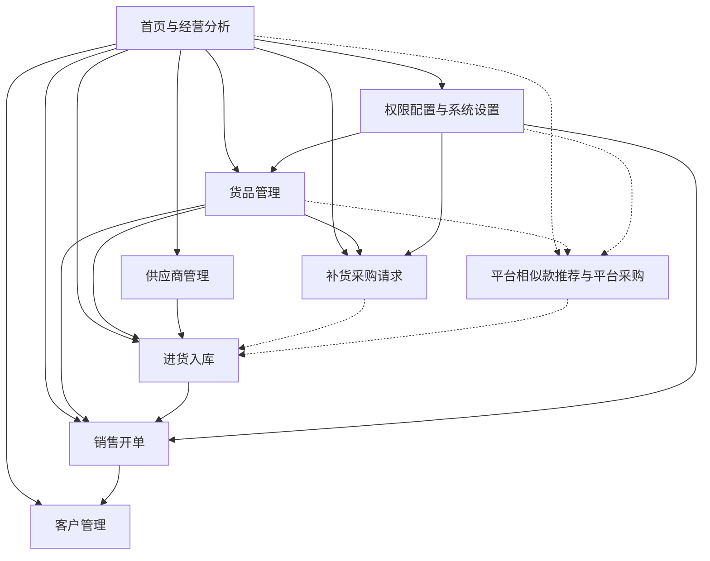

# 功能关联图谱

> 维护各功能模块之间的依赖、数据流与复用关系。PRD 撰写前必须查阅，确保新功能不破坏既有结构。
> 最后更新：2026-08-07。来源：《卖货猫app产品使用手册》与《APP页面设计规范及功能位置参考.md》（多店版）。
> 页面/导航结构以 `product-knowledge/ui/pages.md` 与 `ui/design-system.md` 为准。

## 页面导航关系

> 页面ID 与快照见 `ui/pages.md`。多店版主导航：顶部三 Tab（首页/数据/营销）+ 右下角「更多功能」悬浮按钮。

| 页面ID | 页面名 | 导航入口 | 关联模块 |
|--------|--------|---------|---------|
| `home` | 首页（仪表盘） | 打开 App | 07-home、全部模块入口 |
| `data` | 数据页 | 顶部Tab「数据」 | 07-home（经营分析） |
| `marketing` | 营销页 | 顶部Tab「营销」 | 03-customer（会员+营销工具） |
| `more` | 更多功能页 | 右下角悬浮按钮 | 06-settings（设置/供应商/库存管理等分类聚合） |
| `sales-create` | 开单页 | 首页卖货卡片「开单」 | 04-sales |
| `sales-list` | 销售单列表 | 开单成功/挂单入口 | 04-sales |
| `goods-list` / `goods-detail` | 货品列表/详情 | 首页货品卡片「详情>」 | 01-goods |
| `goods-entry` / `goods-create` | 建款方式选择/新建货品 | 首页货品卡片「建款」 | 01-goods |
| `purchase-create` / `purchase-list` | 新建进货单/采购进货列表 | 首页进货卡片「进货」「详情>」 | 02-purchase |
| `purchase-detail` | 进货单详情 | 进货单列表点击单据 | 02-purchase |
| `replenishment-tab` | 采购进货补货单 Tab | 采购进货页「补货单」 | 02-purchase（独立于 08-replenishment） |
| `customer-list` / `customer-detail` | 客户/会员列表与详情 | 首页会员卡片「详情>」/会员列表点击会员 | 03-customer |
| `replenish-select` | 补货选品页 | 设计记录为首页进货卡片「补货」快捷按钮；当前老板账号未显示，入口待确认 | 08-replenishment |
| `settings` | 系统设置 | 更多功能页→店铺 | 06-settings |
| `settings-permissions` / `role-list` / `role-edit` | 员工权限聚合、岗位列表、岗位编辑 | 更多功能页→员工权限 | 06-settings |
| `account-drawer` / `store-settings` | 店铺账户侧栏/门店设置 | 店铺头像→门店设置 | 06-settings |
| `inventory-list` / `inventory-create` | 库存盘点/盘点计划 | 更多功能页→库存管理→库存盘点 | 06-settings |
| `transfer-list` / `transfer-detail` | 跨店调拨/确认入库 | 更多功能页→库存管理→跨店调拨 | 06-settings |
| `checkout` | 结算页 | 开单页→去收银 | 04-sales |

## 功能清单索引

| 功能模块 | 文件 | 简介 |
|---------|------|------|
| 货品管理 | `features/01-goods.md` | 新增/列表/详情/复制/自动算价/滞销/停用/批量调价 |
| 进货入库 | `features/02-purchase.md` | 一手货源/扫码入库/入库单/进货单管理 |
| 客户管理 | `features/03-customer.md` | 新增/列表/详情/画像/消费记录 |
| 销售开单 | `features/04-sales.md` | 三步开单/赠品/欠货/挂单/退货/收银/打印 |
| 供应商管理 | `features/05-supplier.md` | 列表/新增/修改 |
| 权限配置与系统设置 | `features/06-settings.md` | 岗位权限/价格规则/滞销/停用/抹零规则 |
| 首页与经营分析 | `features/07-home.md` | 经营看板/功能入口 |
| 补货采购请求 | `features/08-replenishment.md` | SKU 选品加车/补货车/采购请求管理 |
| 平台相似款推荐与平台采购（规划） | `features/09-platform-similar-purchase.md` | 图片相似款检测/平台货品详情/平台购物车/平台采购请求 |

## 依赖关系



### 关系说明

- **首页 → 全部模块**：首页是仪表盘与功能入口聚合，各数据卡片右上角红色胶囊按钮（开单/进货/添客/建款）直达核心操作；当前老板账号实机只看到进货卡片「进货」，未看到「补货」快捷按钮。
- **数据页 = 经营分析**：销售&利润/货品分析/会员分析/店员业绩/营业汇总 5 大分析入口，数据来源于货品/进货/开单/客户。
- **营销页 = 客户/会员 + 营销工具**：会员模块（等级/充值/运营/群发/会员码）依赖客户数据；营销工具（优惠券/满减/限时折扣等）作用于开单。
- **更多功能页 = 低频功能分类聚合**：店铺（门店设置/员工权限/定价设置等）、硬件设备、供应商、库存管理（库存盘点/跨店调拨）。
- **货品 → 进货**：进货入库关联货品资料与供应商，入库后增加库存。
- **货品 → 开单**：开单选品依赖货品（价格、库存、品类）。
- **货品 → 补货采购请求**：补货选品依赖货品 SKU/库存/价格数据。
- **首页 → 补货采购请求**：设计记录中的入口为首页进货卡片右上角「补货」快捷按钮；当前 v1.43.6 老板账号未显示，入口是否启用需按版本/功能开关确认。
- **进货单 → 采购进货补货单 Tab**：实机采购进货页存在「补货单」Tab，展示平台货品/其他货品购物车及未处理/已处理/已失效状态；这是 02-purchase 内的独立能力。
- **补货采购请求 ≠ 采购进货补货单 Tab**：前者是 08-replenishment 的 SKU 采购请求，提交不改库存；后者是平台货品/其他货品处理购物车。两者不得复用页面、实体、字段或状态机。
- **平台相似款推荐 → 平台采购**：平台相似款推荐依赖本地货品图片、SKU 和平台商品目录；平台购物车提交平台采购请求，不直接改变本地库存。
- **平台采购 → 平台入库**：平台到货后沿用既有平台入库能力；本期不定义采购请求到入库单的自动关联。
- **进货 → 开单**：进货是库存来源，开单消耗库存。
- **开单 → 客户**：开单关联客户，生成消费记录。
- **供应商 → 进货**：进货单关联供应商。
- **补货采购请求 → 进货（衔接）**：迭代 2 中补货采购请求可作为新建入库单的数据源（虚线，MVP 未打通）。
- **系统设置 → 货品/开单**：价格公式影响货品售价；滞销/停用规则作用于货品；抹零规则作用于开单收银。
- **系统设置 → 补货采购请求**：该功能属于后续范围；当前不展开店长/店员权限划分。
- **客户 → 经营分析**：客户画像、消费记录支撑经营分析。

## 数据流

```text
新增货品（含自动算价）-> 进货入库（增加库存）
  -> 销售开单（选择货品/客户，减库存）
  -> 生成销售单与消费记录
  -> 首页看板展示营业额/开票数/销售件数/毛利率
```

- **库存流转**：进货入库(+) → 开单销售(-) → 退货(+)，退货=负数量开单。
- **价格来源**：货品价格公式（店铺级/品类级）→ 商品销售价/会员价/进货价 → 开单应收金额。
- **客户数据流**：新增客户 → 开单关联 → 消费记录/画像沉淀。

## 复用组件 / 公共能力

| 公共能力 | 被哪些功能使用 |
|---------|---------------|
| 设计系统/组件库（见 `ui/design-system.md`） | 全部页面：主按钮/标签/数据卡片/悬浮按钮/Tab |
| 扫码能力（商品码/包裹码） | 进货入库、销售开单、补货（选品扫码） |
| 货品搜索/筛选 | 开单选品、进货添加货品、批量调价、补货选品 |
| 图片相似度检测（规划） | 首页拍照、货品列表提示、新建货品图片检测、采购单 SKU 检测 |
| 平台货品目录/购物车（规划） | 平台相似款推荐、平台货品详情、平台采购请求 |
| 打印标签/小票 | 货品、销售开单 |
| 价格规则（公式+取整） | 货品、开单（抹零） |
| 岗位权限 | 客户、进货、经营分析、供应商、营销工具、进货单、补货采购请求、采购进货补货单 Tab |
| 收银账户（类型+组合收款） | 销售开单 |
| 会员/营销能力 | 营销页（等级/充值/运营/群发/优惠券/满减/限时折扣） |

## 冲突与约束

- **退货商品不可设为欠货**：开单时退货（负数量）商品不能标记欠货。
- **品类级价格优先**：单独设置品类定价后，店铺全局配置失效。
- **滞销规则作用于货品**：自动滞销按上架日期/最后销售时间超天数判断，可按品类配置。
- **权限前置**：老板账号开放全部功能；店长、店员按岗位配置访问和操作权限，未授权不可操作。
- **岗位权限结构**：实机权限配置包含老板、店长、店员岗位；岗位编辑页按客户、货品、库存、销售、供应商、采购等业务域配置基础/关键权限。
- **库存=0 自动停用**：进货后 x 天库存=0 时自动停用货品。

## 建议的新功能关联检查项

设计新功能时，回答以下问题并写入 PRD：
1. 它依赖哪些既有模块？（上游依赖）
2. 它会改变哪些既有模块的行为？（下游影响）
3. 是否可复用公共能力（扫码/搜索/打印/价格规则/岗位权限）？
4. 是否与既有规则冲突（退货不欠货/品类价格优先/库存停用）？
5. 是否需要更新术语表或补充新规则？
