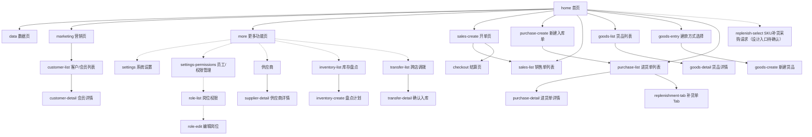

# 页面结构总表（Page Registry）

> 记录 App 各重要页面的结构、元素、交互与导航。PRD「页面与交互」章节必须引用页面ID、沿袭页面范式，禁止自造布局。
> 来源：《APP页面设计规范及功能位置参考.md》（多店版）。最后更新：2026-08-07。
> 覆盖缺失页面标注「待补充」，填充前先对照截图/使用手册确认。

## 页面注册表

| 页面ID | 页面名 | 所属功能模块 | 导航入口 | 快照 |
|--------|--------|-------------|---------|------|
| `home` | 首页（数据概览仪表盘） | 07-home | 打开App 默认落地 | `## 页面:home` |
| `data` | 数据页 | 07-home | 顶部Tab「数据」 | `## 页面:data` |
| `marketing` | 营销页 | 03-customer | 顶部Tab「营销」 | `## 页面:marketing` |
| `more` | 更多功能页 | 06-settings | 右下角「更多功能」悬浮按钮 | `## 页面:more` |
| `sales-create` | 开单页（收银） | 04-sales | 首页卖货卡片右上角「开单」 | `## 页面:sales-create` |
| `sales-list` | 销售单列表 | 04-sales | 开单成功后/销售单入口 | `## 页面:sales-list`（设计快照待补充；实机观察见 device-observation） |
| `goods-list` | 货品列表 | 01-goods | 首页货品卡片「详情>」 | `## 页面:goods-list`（设计快照待补充；实机观察见 device-observation） |
| `goods-detail` | 货品详情 | 01-goods | 货品列表点击货品 | `## 页面:goods-detail`（设计快照待补充；实机观察见 device-observation） |
| `goods-entry` | 建款方式选择 | 01-goods | 首页货品卡片「建款」 | `## 页面:goods-entry`（实机观察见 device-observation） |
| `goods-create` | 新建货品 | 01-goods | 建款方式选择→新建单款 | `## 页面:goods-create`（实机观察见 device-observation） |
| `purchase-create` | 新建入库单 | 02-purchase | 首页进货卡片「进货」 | `## 页面:purchase-create`（待补充） |
| `purchase-list` | 进货单列表 | 02-purchase | 首页进货卡片「详情>」 | `## 页面:purchase-list`（设计快照待补充；实机观察见 device-observation） |
| `purchase-detail` | 进货单详情 | 02-purchase | 进货单列表点击单据 | `## 页面:purchase-detail`（实机观察见 device-observation） |
| `customer-list` | 客户/会员列表 | 03-customer | 营销页会员模块/首页会员卡片 | `## 页面:customer-list`（设计快照待补充；实机观察见 device-observation） |
| `customer-detail` | 会员详情 | 03-customer | 会员列表点击会员 | `## 页面:customer-detail`（实机观察见 device-observation） |
| `supplier-list` | 供应商管理 | 05-supplier | 更多功能→供应商 | `## 页面:supplier-list`（实机观察见 device-observation） |
| `supplier-detail` | 供应商详情 | 05-supplier | 供应商列表点击供应商 | `## 页面:supplier-detail`（实机观察见 device-observation） |
| `replenish-select` | 补货选品页（SKU采购请求） | 08-replenishment | 后续新功能，入口和页面待定义 | `## 页面:replenish-select`（待补充） |
| `replenishment-tab` | 采购进货补货单 Tab（平台货品处理） | 02-purchase | 采购进货→补货单 | `## 页面:replenishment-tab`（实机观察见 device-observation；独立于 08-replenishment） |
| `inventory-list` | 库存盘点 | 06-settings | 更多功能→库存管理→库存盘点 | `## 页面:inventory-list`（实机观察见 device-observation） |
| `inventory-create` | 盘点计划 | 06-settings | 库存盘点→新增计划 | `## 页面:inventory-create`（实机观察见 device-observation） |
| `transfer-list` | 跨店调拨 | 06-settings | 更多功能→库存管理→跨店调拨 | `## 页面:transfer-list`（实机观察见 device-observation） |
| `transfer-detail` | 确认入库 | 06-settings | 跨店调拨→查看 | `## 页面:transfer-detail`（实机观察见 device-observation） |
| `settings` | 系统设置（更多功能分类） | 06-settings | 更多功能页→店铺→门店设置等 | `## 页面:settings`（待补充） |
| `account-drawer` | 店铺账户侧栏 | 06-settings | 店铺头像/账户入口 | `## 页面:account-drawer`（实机观察见 device-observation） |
| `store-settings` | 门店设置 | 06-settings | 店铺账户侧栏→门店设置 | `## 页面:store-settings`（实机观察见 device-observation） |
| `settings-permissions` | 员工/权限管理 | 06-settings | 更多功能页→员工权限 | `## 页面:settings-permissions`（实机观察见 device-observation） |
| `role-list` | 岗位权限 | 06-settings | 员工/权限管理→岗位权限 | `## 页面:role-list`（实机观察见 device-observation） |
| `role-edit` | 编辑岗位 | 06-settings | 岗位权限→编辑权限 | `## 页面:role-edit`（实机观察见 device-observation） |
| `checkout` | 结算页 | 04-sales | 开单页→去收银 | `## 页面:checkout`（实机观察见 device-observation） |

## 页面导航图



---

## 页面:home

- **页面ID**：`home`｜**页面名**：首页（数据概览仪表盘）｜**所属模块**：07-home
- **导航路径**：打开 App 默认落地页。

### 布局示意

```text
┌─────────────────────────────────┐
│ [头像] 多店测试 ⇋        [日历] │  顶部栏：店铺切换 + 日历
│  首页    数据    营销           │  Tab导航
├─────────────────────────────────┤
│ 通知  2026年 去查看 ✕          │  通知横幅（可关闭）
├─────────────────────────────────┤
│ 2026.08.07 [星期五]▼ 编辑 展示 说明 │  日期选择 + 操作栏
├─────────────────────────────────┤
│ 📦 卖货              [开单] 详情>│  模块1：卖货
│ 订单/销售件数/营业额(元)         │
│ 客单价/连带率/客单数(件)         │
│ 单笔最多(件)/单笔最高(元)        │
├─────────────────────────────────┤
│ 🛒 进货                  [进货] 详情>│  模块2：进货
│ 款数(款)/件数(件)/合计(元)       │
├─────────────────────────────────┤
│ 👥 会员              [添客] 详情>│  模块3：会员
│ 总数(人)/新增(人)/复购(人)       │
├─────────────────────────────────┤
│ 📋 货品              [建款] 详情>│  模块4：货品
│ 总数(件)/增加(件)/减少(件)       │
└─────────────────────────────────┘
                     [更多功能]●   右下角悬浮按钮
```

### 关键元素

| # | 元素 | 类型 | 位置 | 文案/默认值 | 行为 |
|---|------|------|------|------------|------|
| 1 | 店铺切换 | 顶部栏 | 左上 | 当前店铺名「多店测试」+ ⇋ | 点击切换店铺 |
| 2 | 日历 | 顶部栏 | 右上 | 日历icon | 点击进入日历/日期视图 |
| 3 | Tab导航 | 顶部Tab | 首页/数据/营销 | 「首页」高亮（红色） | 点击横向切换三页 |
| 4 | 通知横幅 | 横幅 | 数据区上方 | 「通知 2026年 去查看 ✕」 | 可关闭 |
| 5 | 日期选择 | 操作栏 | 通知下方 | 「2026.08.07 [星期五]▼」 | 下拉选择日期 |
| 6 | 编辑/展示/说明 | 操作按钮 | 日期右侧 | 编辑、展示、说明 | 自定义看板显示 |
| 7 | 卖货卡片 | 数据卡片 | 模块1 | 订单/销售件数/营业额/客单价/连带率/客单数/单笔最多/单笔最高 | 三列网格，数据今日实时 |
| 8 | 开单按钮 | 红色胶囊主按钮 | 卖货卡片右上角 | 「开单」 | 直达开单页 `sales-create` |
| 9 | 进货卡片 | 数据卡片 | 模块2 | 款数/件数/合计 | 点击进入进货 |
| 10 | 进货按钮 | 红色胶囊主按钮 | 进货卡片右上角 | 「进货」 | 直达新建入库单 `purchase-create` |
| 11 | 会员卡片 | 数据卡片 | 模块3 | 总数/新增/复购 | 点击进入客户/会员 |
| 12 | 添客按钮 | 红色胶囊主按钮 | 会员卡片右上角 | 「添客」 | 新增客户 |
| 13 | 货品卡片 | 数据卡片 | 模块4 | 总数/增加/减少 | 点击进入货品 |
| 14 | 建款按钮 | 红色胶囊主按钮 | 货品卡片右上角 | 「建款」 | 新建货品 |
| 15 | 详情> | 链接按钮 | 各卡片右上角 | 「详情>」 | 进入对应模块详情页 |
| 16 | 更多功能 | 悬浮按钮 | 右下角 | 圆形红色「更多功能」 | 进入 `more` 更多功能页 |

### 页面状态

| 状态 | 表现 |
|------|------|
| 默认 | 各卡片展示今日数据，数据为 0 时显示 0 |
| 空态 | 无业务数据时数值为 0，卡片仍展示 |
| 多店 | 顶部展示当前店铺名，可切换 |

### 跳转关系
- 前往：`data`、`marketing`、`more`、`sales-create`、`purchase-create`、`replenish-select`、`goods-list`、`customer-list`、`purchase-list`、`sales-list`
- 来源：App 启动

---

## 页面:data

- **页面ID**：`data`｜**页面名**：数据页｜**所属模块**：07-home（经营分析）
- **导航路径**：顶部Tab「数据」。

### 布局示意（上：销售趋势）

```text
┌─────────────────────────────────┐
│ 💰销售&利润 📊货品分析 👥会员分析│  顶部5个功能入口（横向滚动）
│ 📈店员业绩 📑营业汇总           │
├─────────────────────────────────┤
│ 2026.08.07[星期五]▼ [环比][同比] 导出│  日期 + 对比方式 + 导出
├─────────────────────────────────┤
│ 📈 销售趋势                      │  折线图区域（7日趋势，红色折线，Y轴金额）
├─────────────────────────────────┤
│ [销]     昨日    今日    环比    │  销售数据表格
│ 销售数/销售额/销售笔数/抹零       │
└─────────────────────────────────┘
```

### 布局示意（下：库存与利润）

```text
┌─────────────────────────────────┤
│ 购买会员数  0  0  0              │
├─────────────────────────────────┤
│ [货]     昨日    今日    环比    │  库存/进货数据块
│ 库存数/库存价值/进货数/进货额/   │
│ 进货笔数/退货数/退货额/滞销数     │
├─────────────────────────────────┤
│ [利]     昨日    今日    环比    │  利润数据块
│ 毛利润  0  0  0                  │
└─────────────────────────────────┘
```

### 关键元素

| # | 元素 | 类型 | 位置 | 文案/默认值 | 行为 |
|---|------|------|------|------------|------|
| 1 | 分析入口 | 功能图标 | 顶部横向滚动 | 销售&利润/货品分析/会员分析/店员业绩/营业汇总 | 点击进入对应分析页 |
| 2 | 日期选择 | 下拉 | 图表上方 | 当前日期+[星期五]▼ | 选择日期 |
| 3 | 环比/同比 | 切换 | 日期右侧 | 「环比」「同比」 | 切换对比口径（选中红色） |
| 4 | 导出 | 按钮 | 右上 | 「导出」 | 导出报表 |
| 5 | 销售趋势图 | 折线图 | 图表区 | 7日趋势，红色折线，Y轴金额 | 查看趋势 |
| 6 | 销售数据表 | 对比表 | 表格区 | 销售数/销售额/销售笔数/抹零 | 昨日/今日/环比 三列 |
| 7 | 库存数据块 | 对比表 | 表格区 | 库存数/库存价值/进货数/进货额/进货笔数/退货数/退货额/滞销数 | 「货」标签（蓝色） |
| 8 | 利润数据块 | 对比表 | 表格区 | 毛利润 | 「利」标签（橙色） |

### 页面状态

| 状态 | 表现 |
|------|------|
| 默认 | 展示昨日/今日/环比三列对比 |
| 加载 | 图表区展示加载态 |

### 跳转关系
- 前往：各分析入口详情页（待补充页面ID）、`home`、`marketing`
- 来源：`home`

---

## 页面:marketing

- **页面ID**：`marketing`｜**页面名**：营销页｜**所属模块**：03-customer
- **导航路径**：顶部Tab「营销」。

### 布局示意

```text
┌─────────────────────────────────┐
│ 💎 会员                          │  会员模块
│ 免费会员[位] 付费会员[位]         │
│  9  0                            │
│ [会员等级][付费会员][积分设置]   │  7个功能图标（4+3布局）
│ [会员充值][会员运营][群发消息]    │
│ [会员码]                         │
├─────────────────────────────────┤
│ 🎫 营销                          │  营销模块
│ 自动送券活动[个] 自行创券活动[个] │
│  0  0                            │
│ [优惠券][消费返现][限时折扣]      │  7个功能图标（4+3布局）
│ [满减][自动送券][微相册]         │
│ [AI去水印]                       │
├─────────────────────────────────┤
│ 省心赚钱每一天！                 │  底部slogan
└─────────────────────────────────┘
```

### 关键元素

| # | 元素 | 类型 | 位置 | 文案/默认值 | 行为 |
|---|------|------|------|------------|------|
| 1 | 会员模块 | 数据卡片 | 上部 | 免费会员[位]/付费会员[位] | 会员数据概览 |
| 2 | 会员等级 | 功能图标 | 会员模块 | 「会员等级」 | 管理会员等级 |
| 3 | 付费会员 | 功能图标 | 会员模块 | 「付费会员」 | 开通/管理付费会员 |
| 4 | 积分设置 | 功能图标 | 会员模块 | 「积分设置」 | 配置积分规则 |
| 5 | 会员充值 | 功能图标 | 会员模块 | 「会员充值」 | 会员储值充值 |
| 6 | 会员运营 | 功能图标 | 会员模块 | 「会员运营」 | 会员营销运营 |
| 7 | 群发消息 | 功能图标 | 会员模块 | 「群发消息」 | 会员消息群发 |
| 8 | 会员码 | 功能图标 | 会员模块 | 「会员码」 | 展示/扫码会员码 |
| 9 | 营销模块 | 数据卡片 | 下部 | 自动送券活动[个]/自行创券活动[个] | 营销活动概览 |
| 10 | 优惠券/消费返现/限时折扣/满减/自动送券/微相册/AI去水印 | 功能图标 | 营销模块（4+3） | 各营销工具名 | 进入对应营销工具 |
| 11 | slogan | 文案 | 底部 | 「省心赚钱每一天！」 | — |

### 页面状态

| 状态 | 表现 |
|------|------|
| 默认 | 展示会员与营销活动数量 |
| 空态 | 活动数量为 0 |

### 跳转关系
- 前往：`customer-list`（客户/会员列表）、各营销工具页（待补充页面ID）、`home`、`data`
- 来源：`home`

---

## 页面:more

- **页面ID**：`more`｜**页面名**：更多功能页｜**所属模块**：06-settings
- **导航路径**：右下角「更多功能」悬浮按钮。

### 布局示意

```text
┌─────────────────────────────────┐
│ ←         更多功能               │  顶部返回 + 标题
├─────────────────────────────────┤
│▌常用功能                [编辑]   │  常用功能区（可自定义）
│ [货品信息][个性配置][采购退货][员工权限]│
├─────────────────────────────────┤
│ 全部功能                        │
├─────────────────────────────────┤
│ 店铺（8个）                      │  分类1
│ [门店设置][员工权限][收款方式][分店模式]│
│ [个性配置][货品信息][店铺收支][定价设置]│
├─────────────────────────────────┤
│ 硬件设备（2个）                  │  分类2
│ [打印设置][扫码枪]               │
├─────────────────────────────────┤
│ 供应商（2个）                    │  分类3
│ [供应商][采购退货]               │
├─────────────────────────────────┤
│ 库存管理（2个）                  │  分类4
│ [库存盘点][跨店调拨]             │
└─────────────────────────────────┘
```

### 关键元素

| # | 元素 | 类型 | 位置 | 文案/默认值 | 行为 |
|---|------|------|------|------------|------|
| 1 | 返回 | 按钮 | 顶部左上 | 「←」 | 返回上一页 |
| 2 | 标题 | 标题 | 顶部居中 | 「更多功能」 | — |
| 3 | 常用功能 | 分组 | 顶部 | 货品信息/个性配置/采购退货/员工权限 | 可自定义排序；「编辑」进入编辑态 |
| 4 | 店铺分组 | 分类列表 | 分类1 | 门店设置/员工权限/收款方式/分店模式/个性配置/货品信息/店铺收支/定价设置 | 点击进入对应设置 |
| 5 | 硬件设备分组 | 分类列表 | 分类2 | 打印设置/扫码枪 | 点击进入对应设置 |
| 6 | 供应商分组 | 分类列表 | 分类3 | 供应商/采购退货 | 点击进入 |
| 7 | 库存管理分组 | 分类列表 | 分类4 | 库存盘点/跨店调拨 | 点击进入 |

### 页面状态

| 状态 | 表现 |
|------|------|
| 默认 | 按分类聚合全部低频功能 |
| 自定义 | 「常用功能」可编辑排序 |

### 跳转关系
- 前往：`settings`（各设置页）、供应商列表、库存盘点/跨店调拨（待补充页面ID）
- 来源：`home` / `data` / `marketing`（右下角悬浮按钮）

---

## 页面:sales-create

- **页面ID**：`sales-create`｜**页面名**：开单页（收银）｜**所属模块**：04-sales
- **导航路径**：首页卖货卡片右上角「开单」→ 开单页。

### 布局示意

```text
┌─────────────────────────────────┐
│ ←         开单           挂单   │  顶部返回 + 标题 + 挂单
├─────────────────────────────────┤
│ 阿里 普通会员                >   │  会员信息栏
│ 积分:0  余额:¥0                 │
├─────────────────────────────────┤
│ 价格类型               销售价 >  │  价格类型选择
│ 整单打折               不打折 >  │  折扣设置
├─────────────────────────────────┤
│ [手机扫码] [+选择货品] [扫码枪]  │  添加货品三种方式
│                         未连接  │
├─────────────────────────────────┤
│ 小吊带背心        [赠品][欠货][🗑]│  商品行1
│ [图] 款号:S9167  规格:白色/均码  │
│      销售价:¥36.09              │
│      实收价:1件*¥36.09=¥36.09 ✎ │
├─────────────────────────────────┤
│ 260615001        [赠品][欠货✓][🗑]│  商品行3（欠货选中）
│ [图] 款号:260615001 规格:黑色/40即L码│
│      销售价:¥88                 │
│      实收价:1件*¥88.00=¥88.00 ✎ │
├─────────────────────────────────┤
│ 售4件 退0件 应收¥432.09 [去收银]│  底部固定结算栏
│ 优惠¥0.00 | 查看明细 ▲          │
└─────────────────────────────────┘
```

### 关键元素

| # | 元素 | 类型 | 位置 | 文案/默认值 | 行为 |
|---|------|------|------|------------|------|
| 1 | 返回 | 按钮 | 顶部左上 | 「←」 | 返回 |
| 2 | 标题 | 标题 | 顶部居中 | 「开单」 | — |
| 3 | 挂单 | 按钮 | 顶部右上 | 「挂单」 | 挂起当前单据，可稍后继续 |
| 4 | 会员信息栏 | 信息栏 | 会员区 | 会员名「阿里 普通会员」+ 积分/余额 | 点击「>」选择会员 |
| 5 | 价格类型 | 下拉 | 设置区 | 「销售价 >」 | 切换价格类型（销售价/会员价等） |
| 6 | 整单打折 | 下拉 | 设置区 | 「不打折 >」 | 设置整单折扣 |
| 7 | 手机扫码 | 按钮 | 添加区 | 「手机扫码」 | 相机扫码添加货品 |
| 8 | 选择货品 | 按钮 | 添加区 | 「+选择货品」 | 打开货品选择 |
| 9 | 扫码枪 | 按钮 | 添加区 | 「扫码枪 未连接」 | 连接/使用扫码枪 |
| 10 | 商品行 | 列表行 | 商品区 | 货品名/款号/规格/销售价/实收价 | 每行含「赠品」「欠货」标签按钮与「🗑」删除、「✎」改价 |
| 11 | 赠品标签 | 标签按钮 | 商品行右侧 | 「赠品」 | 切换赠品状态（选中红色） |
| 12 | 欠货标签 | 标签按钮 | 商品行右侧 | 「欠货」/「欠货✓」 | 切换欠货状态（选中红色） |
| 13 | 删除 | 图标按钮 | 商品行右侧 | 「🗑」 | 移除商品 |
| 14 | 修改实收价 | 图标按钮 | 商品行 | 「✎」 | 修改单个商品价格 |
| 15 | 底部结算栏 | 固定栏 | 底部 | 「售4件 退0件 应收¥432.09 [去收银]」「优惠¥0.00 查看明细▲」 | 固定展示合计；「去收银」进入收银结算 |

### 页面状态

| 状态 | 表现 |
|------|------|
| 默认 | 已加商品展示行明细，底部结算栏实时合计 |
| 空态 | 无商品时底部应收 ¥0 |
| 欠货 | 商品行「欠货」标签红色选中 |
| 赠品 | 商品行「赠品」标签红色选中 |
| 挂单 | 顶部「挂单」保留当前数据，可恢复继续开单 |

### 跳转关系
- 前往：货品选择（`goods-list`）、会员选择、收银结算页（待补充页面ID）、`sales-list`（挂单/完成后）
- 来源：`home`（开单）、`sales-list`（挂单恢复）

---

## 待补充页面

> 以下页面的完整设计快照仍待补充；其中部分页面已有 iPhone 16 Pro 实机观察，详见 `device-observation-2026-08-07.md`。补充时沿用设计系统规范（`ui/design-system.md`）与既有范式（数据卡片/红色胶囊主按钮/分类聚合/左滑操作）。

- `sales-list` 销售单列表：挂单列表、销售/退货/总金额/实收金额、左滑作废、打印、开单按钮。
- `goods-list` 货品列表：货品数量/库存货值/预计销售、批量操作、左滑停用/置顶。
- `goods-detail` 货品详情：货品信息/库存记录/价格数据/停用/编辑/打印标签。
- `purchase-create` 新建入库单：选择供应商、入库日期、添加货品/扫码入库。
- `purchase-list` 进货单列表：进货单/一手订单切换、详情/打印/作废。
- `customer-list` 客户/会员列表：会员列表、标签/画像/消费记录。
- `replenish-select` 补货选品页：后续 SKU 补货采购请求的选品/补货车页面；入口和页面结构待定义。
- `settings` 系统设置：门店设置/员工权限/收款方式/定价设置/货品信息等。
